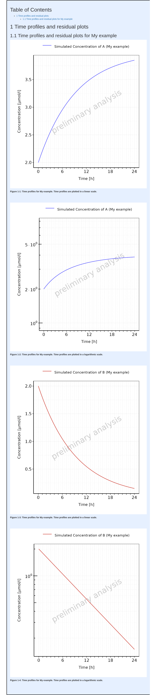

# Get Started

``` r

require(ospsuite.reportingengine)
#> Loading required package: ospsuite.reportingengine
#> Loading required package: tlf
#> Loading required package: ospsuite
#> 
#> Attaching package: 'ospsuite'
#> The following object is masked from 'package:tlf':
#> 
#>     plotTimeProfile
#> Warning: replacing previous import 'ospsuite::plotTimeProfile' by
#> 'tlf::plotTimeProfile' when loading 'ospsuite.reportingengine'
```

This vignette introduces the notions and objects implemented in the
OSP-Suite Reporting Engine package (`ospsuite.reportingengine`).

## 1. Introduction

### 1.1. Notion of R6 objects

The `ospsuite.reportingengine` package aims at facilitating the design
and build of reports evaluating PBPK models developed on PK-Sim or/and
MoBi.

To this end, the package benefits from the concept of [R6
classes](https://r6.r-lib.org/articles/Introduction.html) (similar to
reference classes) which allows to define structured objects whose
fields can be any object such as properties, methods or even other R6
objects. R6 objects, or objects from R6 class, presents some
peculiarities.

- They are usually initialized using the method `$new(...)`
  (e.g. `r6Object <- R6Class$new()`).
- Similarly to objects of class list, fields from R6 objects can be
  called using either `$fieldName` or `[[fieldName]]`
  (e.g. `r6Object$method()` or `r6Object[[property]]`).
- The R6 class also integrates the concept of inheritance: an R6 object
  will get the attributes from its class but will also inherit
  properties and methods from a parent class.

### 1.2. Notion of workflow

The `ospsuite.reportingengine` package is built around 3 central R6
classes **`MeanModelWorkflow`**, **`PopulationWorkflow`** and
**`QualificationWorkflow`** derived from the parent R6 class `Workflow`.
The creation of `MeanModelWorkflow` or `PopulationWorkflow` objects
provides a structured environment with methods and properties that
facilitate the design, run and report of the evaluations of PBPK models
developed on PK-Sim or/and MoBi. For `QualificationWorkflow` objects,
more details are available in a dedicated
[article](https://www.open-systems-pharmacology.org/OSPSuite.ReportingEngine/articles/qualification-workflow.md).
The `Worklow` objects combine 2 features defined as R6 objects:

- `SimulationSet` and `PopulationSimulationSet` objects defines which
  and how model(s) and/or data can be used by the workflow (developed in
  more details in section [3](#id_3-simulation-sets)). These objects
  need to be created before the creation of workflow objects as they are
  required to create the workflow.
- `Task` objects define the evaluations to be performed by the workflow.
  These objects are directly created and included upon creation of the
  `Workflow` objects (developed in more details in section
  [4](#id_4-tasks)). Their settings can be checked and updated after
  creation.

### 1.3. Nomenclature

Table 1 enumerates some of the main instances of the
`ospsuite.reportingengine` package usually defined by users during the
design of a workflow. The tab
[Reference](https://www.open-systems-pharmacology.org/OSPSuite.ReportingEngine/reference/index.md)
documents available classes and functions exported by the
`ospsuite.reportingengine` package. The comprehensive documentation and
usage of each of these objects is accessible in the tab **Reference**.

**Table 1: Nomenclature of `ospsuite.reportingengine` main instances**

| **Workflow objects** | **Use case** |
|----|----|
| [MeanModelWorkflow](https://www.open-systems-pharmacology.org/OSPSuite.ReportingEngine/reference/MeanModelWorkflow.md) | Defined by user |
| [PopulationWorkflow](https://www.open-systems-pharmacology.org/OSPSuite.ReportingEngine/reference/PopulationWorkflow.md) | Defined by user |
| [QualificationWorkflow](https://www.open-systems-pharmacology.org/OSPSuite.ReportingEngine/reference/loadQualificationWorkflow.md) | Built in [loadQualificationWorkflow](https://www.open-systems-pharmacology.org/OSPSuite.ReportingEngine/reference/QualificationWorkflow.md) |
| **Simulation Set objects** | **Use case** |
| [SimulationSet](https://www.open-systems-pharmacology.org/OSPSuite.ReportingEngine/reference/SimulationSet.md) | Defined by user |
| [PopulationSimulationSet](https://www.open-systems-pharmacology.org/OSPSuite.ReportingEngine/reference/PopulationSimulationSet.md) | Defined by user |
| [ConfigurationPlan](https://www.open-systems-pharmacology.org/OSPSuite.ReportingEngine/reference/ConfigurationPlan.md) | Built in [loadQualificationWorkflow](https://www.open-systems-pharmacology.org/OSPSuite.ReportingEngine/reference/QualificationWorkflow.md) |
| **Output path and PK parameter objects** | **Use case** |
| [Output](https://www.open-systems-pharmacology.org/OSPSuite.ReportingEngine/reference/Output.md) | Defined by user |
| [PkParameterInfo](https://www.open-systems-pharmacology.org/OSPSuite.ReportingEngine/reference/PkParameterInfo.md) | Defined by user |
| **Workflow task objects** | **Use case** |
| [Task](https://www.open-systems-pharmacology.org/OSPSuite.ReportingEngine/reference/Task.md) | Built in workflow objects |
| [SimulationTask](https://www.open-systems-pharmacology.org/OSPSuite.ReportingEngine/reference/SimulationTask.md) | Built in workflow objects |
| [SensitivityAnalysisTask](https://www.open-systems-pharmacology.org/OSPSuite.ReportingEngine/reference/SensitivityAnalysisTask.md) | Built in workflow objects |
| [PopulationSensitivityAnalysisTask](https://www.open-systems-pharmacology.org/OSPSuite.ReportingEngine/reference/PopulationSensitivityAnalysisTask.md) | Built in workflow objects |
| [QualificationTask](https://www.open-systems-pharmacology.org/OSPSuite.ReportingEngine/reference/QualificationTask.md) | Built in [QualificationWorkflow](https://www.open-systems-pharmacology.org/OSPSuite.ReportingEngine/reference/loadQualificationWorkflow.md) objects |
| [PlotTask](https://www.open-systems-pharmacology.org/OSPSuite.ReportingEngine/reference/PlotTask.md) | Built in workflow objects |
| [PopulationPlotTask](https://www.open-systems-pharmacology.org/OSPSuite.ReportingEngine/reference/PopulationPlotTask.md) | Built in [PopulationWorkflow](https://www.open-systems-pharmacology.org/OSPSuite.ReportingEngine/reference/PopulationWorkflow.md) objects |
| [GofPlotTask](https://www.open-systems-pharmacology.org/OSPSuite.ReportingEngine/reference/GofPlotTask.md) | Built in workflow objects |
| **Workflow task settings objects** | **Use case** |
| PlotSettings | Built in workflow objects |
| [SensitivityPlotSettings](https://www.open-systems-pharmacology.org/OSPSuite.ReportingEngine/reference/SensitivityPlotSettings.md) | Built in workflow objects |

### 1.4. General scheme

In order to define and run appropriately a Workflow object, a few steps
are required:

- 1.  Load the `ospsuite.reportingengine` package

``` r

library(ospsuite.reportingengine)
```

- 2.  Define the simulation outputs possibly with their PK parameters

``` r

Output$new()
```

- 3.  Define the simulation sets possibly mapping simulations to
      observed data

``` r

SimulationSet$new()
```

- 4.  Define the workflow and its result folder

``` r

Workflow$new()
```

- 5.  Define the workflow tasks

``` r

workflow$activateTasks()
```

- 6.  Run the workflow

``` r

workflow$runWorkflow()
```

A working example of workflow script is provided below for reporting a
time profile plot on *Minimodel2.pkml*.

**Code**

``` r

# Get the pkml simulation file: "MiniModel2.pkml"
simulationFile <- system.file("extdata", "MiniModel2.pkml",
  package = "ospsuite.reportingengine"
)

# Create Output objects which define output paths that will be plotted by the workflow
outputA <- Output$new(
  path = "Organism|A|Concentration in container",
  displayName = "Concentration of A"
)
outputB <- Output$new(
  path = "Organism|B|Concentration in container",
  displayName = "Concentration of B"
)

# Create a SimulationSet object which defines the model and outputs to evaluate
myExampleSet <- SimulationSet$new(
  simulationSetName = "My example",
  simulationFile = simulationFile,
  outputs = c(outputA, outputB)
)

# Create the workflow object
myExampleWorkflow <-
  MeanModelWorkflow$new(
    simulationSets = myExampleSet,
    workflowFolder = "myExample-Results"
  )

# Set the workflow tasks to be run
myExampleWorkflow$activateTasks(c("simulate", "plotTimeProfilesAndResiduals"))

# Run the workflow
myExampleWorkflow$runWorkflow()
```

For this example, the list of files and folders generated by the
workflow are:

``` r

list.files(myExampleWorkflow$workflowFolder)
#> [1] "log-debug.txt"     "log-info.txt"      "Report-word.md"   
#> [4] "Report.docx"       "Report.md"         "SimulationResults"
#> [7] "TimeProfiles"
```

The associated report will be as follows:

    #> file:////home/runner/work/OSPSuite.ReportingEngine/OSPSuite.ReportingEngine/vignettes/myExample-Results/Report.html screenshot completed

**Report**



## 2. Workflow

[`Workflow`](https://www.open-systems-pharmacology.org/OSPSuite.ReportingEngine/reference/Workflow.md)
objects define which models are evaluated, how they are evaluated and
how the evaluations are reported.

In the `ospsuite.reportingengine` package, two types of `Workflow` are
available and can be created:

1.  [`MeanModelWorkflow`](https://www.open-systems-pharmacology.org/OSPSuite.ReportingEngine/reference/MeanModelWorkflow.md)
    dedicated on evaluations specific to mean models
2.  [`PopulationWorkflow`](https://www.open-systems-pharmacology.org/OSPSuite.ReportingEngine/reference/PopulationWorkflow.md)
    dedicated on evaluations specific to population models

### 2.1. MeanModelWorkflow

Workflows defined by `MeanModelWorkflow` objects can be illustrated by
Figure 1.

The blue frame corresponds to the inputs of the workflow. These inputs
need to be defined using `SimulationSet` objects. For workflows with
multiple simulations and observed datasets, a list of `SimulationSet`
objects can be input instead of one unique `SimulationSet` object.
Within a `Workflow` object, the simulation sets are accessible from the
`simulationStructures` lists which also provides relevant information
about input/output files and folders

The black frames correspond to the tasks or evaluations performed by the
workflow. These tasks are defined using `Task` objects built in every
`Workflow` object, meaning there is no need to input them when creating
a `Workflow` object. Users access, update and switch the task on/off
tasks after creation of their `Workflow`.


Figure 1: Mean model workflow inputs and tasks

### 2.2. PopulationWorkflow

Workflows defined by `PopulationWorkflow` objects can be illustrated by
Figure 2.

The blue frame corresponds to the inputs of the workflow. These inputs
need to be defined using `PopulationSimulationSet` objects. For
workflows with multiple simulations and observed datasets, a list of
`PopulationSimulationSet` objects can be input instead of one unique
`PopulationSimulationSet` object. Within a `Workflow` object, the
simulation sets are accessible from the `simulationStructures` lists
which also provides relevant information about input/output files and
folders

The black frames correspond to the tasks or evaluations performed by the
workflow. These tasks are defined using `Task` objects built in every
`Workflow` object, meaning there is no need to input them when creating
a `Workflow` object. Users access, update and switch the task on/off
tasks after creation of their `Workflow`.

Some tasks of population workflows perform a direct comparison of the
simulation sets (e.g. `plotDemography` or `plotPKParameters`). Such
comparisons can be different according to the selected population
workflow types. Three population workflow types are available in
`ospsuite.reportingengine` and defined in `PopulationWorkflowTypes`:

1.  **Pediatric** (`workflowType = "pediatric"`)
    - All properties (physiology and PK Parameter) are plotted vs. age
      and weight,
    - The time profiles are plotted in comparison to a reference
      population the sensitivity analysis is done on all populations
      except the reference population
2.  **Parallel Comparison** (`workflowType = "parallelComparison"`)
    - PK parameter are plotted parallel in Box-Whisker plots without a
      reference population,
    - If a reference population is given, the time profiles are plotted
      in comparison to this population
    - The sensitivity analysis is done on all populations
3.  **Ratio Comparison** (`workflowType = "ratioComparison"`)
    - Same as parallel comparison, but for the PK Parameter additional
      the ratio of the PK Parameter to the reference population is
      calculated and plotted in box-whisker plots


Figure 2: Population workflow inputs and tasks

### 2.3. Qualification Workflow

Another type of workflow can be defined by `QualificationWorkflow`
objects using a configuration plan for qualification purposes. The
article [Qualification
Workflow](https://www.open-systems-pharmacology.org/OSPSuite.ReportingEngine/articles/qualification-workflow.md)
details how to build and use such `QualificationWorkflow` objects.

### 2.4. Creation of a Workflow

To create a `MeanModelWorkflow` or a `PopulationWorkflow` object, the
method `$new()` needs to be used with at least the inputs defined below.

- For mean model workflows:

``` r

myWorkflow <- MeanModelWorkflow$new(simulationSets, workflowFolder)
```

- For population workflows:

``` r

myWorkflow <- 
PopulationWorkflow$new(workflowType, simulationSets, workflowFolder)
```

where the input `simulationSets` is a list of `SimulationSet` objects
for a mean model workflow, and a list of `PopulationSimulationSet`
objects for a population workflow.

The input `workflowFolder` is the name of the folder in which the
workflow outputs are saved. As illustrated in Figures 1 and 2, some
tasks use outputs obtained from previous tasks. If the directory
specified in `workflowFolder` contains such outputs, they will be used
by the current workflow. This latter option can be useful for updating
and running only parts of the workflow without having to perform all the
simulations every time.

The input `workflowType` is one of the 3 population workflow types as
defined by `PopulationWorkflowTypes`.

Other optional inputs can be added when creating a workflow:

- `createWordReport`: logical defining if a word version (.docx) of the
  report should be saved besides its markdown version (.md). The default
  value for this option is `TRUE`, meaning that a report in word is also
  created.
- `watermark`: character defining the text to display in figures
  background. The default value is `NULL`, in which case the text
  “preliminary results” will be displayed in the figures for all
  computers using an non-validated environment.
- `simulationSetDescriptor`: character defining a descriptor of how
  simulation sets should be indicated in reports (e.g. “scenario”,
  “set”, “simulation”, or “population”). The default value for this
  option is `NULL`, meaning that there won’t be any descriptor of the
  simulation sets.

### 2.5. Workflow built in methods and properties

After creation of a `Workflow` object, some built in methods and
properties are available (using the character `$` after the name of the
object).

Most of the workflow properties correspond to the inputs used to create
the workflow and includes `createWordReport`, `workflowFolder`,
`reportFilePath`, the list `simulationStructures` and the workflow tasks
(developed in section [4](#id_4-tasks)).

Additionally, the methods listed below can be used to access relevant
information about the workflow:

- [`printReportingEngineInfo()`](https://www.open-systems-pharmacology.org/OSPSuite.ReportingEngine/reference/Workflow.html#public-methods):
  prints information about the environment and packages currently used.
- [`getWatermark()`](https://www.open-systems-pharmacology.org/OSPSuite.ReportingEngine/reference/Workflow.html#public-methods):
  prints the watermark to be displayed by the workflow.
- [`getParameterDisplayPaths()`](https://www.open-systems-pharmacology.org/OSPSuite.ReportingEngine/reference/Workflow.html#public-methods):
  prints the mapping between parameters and their display paths
- [`getSimulationDescriptor()`](https://www.open-systems-pharmacology.org/OSPSuite.ReportingEngine/reference/Workflow.html#public-methods):
  prints the simulation descriptor to be used by the workflow
- [`getAllTasks()`](https://www.open-systems-pharmacology.org/OSPSuite.ReportingEngine/reference/Workflow.html#public-methods):
  prints the names of all the workflow available tasks
- [`getAllPlotTasks()`](https://www.open-systems-pharmacology.org/OSPSuite.ReportingEngine/reference/Workflow.html#public-methods):
  prints the names of all the workflow plot tasks
- [`getActiveTasks()`](https://www.open-systems-pharmacology.org/OSPSuite.ReportingEngine/reference/Workflow.html#public-methods):
  prints the names of all the workflow active tasks
- [`getInactiveTasks()`](https://www.open-systems-pharmacology.org/OSPSuite.ReportingEngine/reference/Workflow.html#public-methods):
  prints the names of all the workflow inactive tasks

To update some of the workflow properties, the methods listed below can
be used:

- [`setWatermark(watermark)`](https://www.open-systems-pharmacology.org/OSPSuite.ReportingEngine/reference/Workflow.html#public-methods):
  set the watermark to be displayed by the workflow. The input
  `watermark` is of type character.
- [`setParameterDisplayPaths(parameterDisplayPaths)`](https://www.open-systems-pharmacology.org/OSPSuite.ReportingEngine/reference/Workflow.html#public-methods):
  set the the mapping between parameters and their display paths. The
  input `parameterDisplayPaths` is of type data.frame and includes
  “parameter” and “displayPath” in its variables. External functions can
  also be used instead:
  - [`setWorkflowParameterDisplayPaths(parameterDisplayPaths, workflow)`](https://www.open-systems-pharmacology.org/OSPSuite.ReportingEngine/reference/setWorkflowParameterDisplayPaths.md)
  - [`setWorkflowParameterDisplayPathsFromFile(fileName, workflow)`](https://www.open-systems-pharmacology.org/OSPSuite.ReportingEngine/reference/setWorkflowParameterDisplayPathsFromFile.md)
- [`setSimulationDescriptor(text)`](https://www.open-systems-pharmacology.org/OSPSuite.ReportingEngine/reference/setSimulationDescriptor.md):
  set the simulation descriptor of the workflow. The input `text` is of
  type character.

Finally, the method `runWorkflow()` runs the simulations and analyses of
the models, and also saves the evaluations and their report.

## 3. Simulation sets

`SimulationSet` and `PopulationSimulationSet` objects includes all the
relevant information needed to report the evaluations of a model.

Below is the syntax for creating such simulation sets, the next
sub-sections will provide more details on each input:

**Simulation Set**

``` r

SimulationSet$new(
  simulationSetName, 
  simulationFile, 
  outputs,
  dataSource,
  dataSelection,
  applicationRanges,
  timeUnit,
  timeOffset,
  minimumSimulationEndTime
)
```

**Population Simulation Set**

``` r

PopulationSimulationSet$new(
  referencePopulation,
  simulationSetName, 
  simulationFile,
  populationFile,
  studyDesignFile, 
  plotReferenceObsData,
  outputs, 
  dataSource,
  dataSelection,
  applicationRanges,
  timeUnit,
  timeOffset,
  minimumSimulationEndTime
)
```

### 3.1. Simulation file

A simulation file, `simulationFile` is an export of a simulation from
MoBi or PK-SIM in pkml format. Display names for the simulation set can
be provided using `simulationSetName`.

### 3.2. Population file

A population file, `populationFile`, is collection of parameter paths
and parameter values normally an export of a population from PK-SIM in
csv format. It is also possible to use an M&S activity-specific
population file, which has the “PK-Sim” format, but was manipulated
after the export from PK-SIM or was generated outside of PK-Sim. The
generation of the population file than must be validated. Display names
for the population can be provided using `simulationSetName`.

#### 3.2.1. Study Design file

The study design file, `studyDesignFile`, contains additional
information on the study design, e.g. a body weight dependent dose in a
pediatric study. A regular csv format is expected for such a file.

The example below shows a template of such a study design content.

| Organism\|Weight | Organism\|Weight | Gender | Applications\|IV Bolus\|DrugMass |
|:---|:---|:---|:---|
| kg | kg |  | nmol |
| SOURCE_MIN | SOURCE_MAX | SOURCE_EQUALS | TARGET |
| 20 | 40 | MALE | 2 |
| 20 | 40 | FEMALE | 2.5 |
| 40 | 60 | MALE | 10 |
| 40 | 60 | FEMALE | 14 |
| 60 |  |  | 20 |

Table 2: Example of study design content {.table}

### 3.3. Format of data files

**If the workflow uses data, two files must be provided within a
`DataSource` object** as follows:

``` r

DataSource$new(dataFile, metaDataFile, caption = NULL)
```

The optional `caption` argument defines the data source displayed
caption in the report.

#### 3.3.1. Data file

The Data file can be a blank separated text file or a csv file, column
headers are used later as R variable names, and they must not contain
special letters like blanks. The data is expected to follow a
[tidy](https://cran.r-project.org/web/packages/tidyr/vignettes/tidy-data.html)
format like Nonmem formatted datasets. All data columns used for figures
and tables, must be numerical and listed in the dictionary/meta data
file (details in section **3.3.2**). For data filtering, these columns
and additional ones can be used, the additional columns may also contain
strings. But be careful that these strings do not contain the column
separator blank. A column must be either numerical or of type string,
they must not contain both.

#### 3.3.2. Dictionary/meta data file

The dictionary is a csv file mapping the data file. Unlike the Matlab
version of the reporting engine, a regular csv with a comma (“,”) as
separator is expected.

The dictionary file must contain the following variables: ‘ID’, ‘type’,
‘datasetColumn’, ‘datasetUnit’, ‘reportName’, ‘pathID’, ‘comment’. For
time profile plots, you must provide ‘**time**’ and ‘**dv**’ in
‘**ID**’. The variable ‘**lloq**’, for lower limit of quantitation, can
also be provided but is not necessary. These variables need to be mapped
to the variable names of the dataset using the dictionary variable
‘**nonmenColumn**’.

Regarding units, two options are possible:

- Providing units using only the dictionary: for ‘**time**’ and ‘**dv**’
  the column ‘**nonmemUnit**’ should be filled with the corresponding
  unit (‘**lloq**’ is assumed with the same unit as ‘**dv**’).
- Providing units within the observed data:
  - the dictionary must include the following new variables in ‘**ID**’:
    ‘**time_unit**’ and ‘**dv_unit**’.
  - the dictionary must also include the mapping to the variable names
    in the dataset using ‘**nonmenColumn**’.

The example below shows content of the dictionary template
[tpDictionary.csv](https://www.open-systems-pharmacology.org/OSPSuite.ReportingEngine/articles/templates/tpDictionary.csv):

| ID | type | datasetColumn | datasetUnit | reportName | pathID | comment |
|:---|:---|:---|:---|:---|:---|:---|
| sid | identifier | SID |  |  |  |  |
| stud | identifier | STUD |  |  |  |  |
| time | timeprofile | TIME | h |  |  |  |
| dv | timeprofile | DV | mg/ml |  |  |  |
| tad | timeprofile | TAD | h |  |  |  |
| age | covariate | AGE | year(s) | Age | Organism\|Age |  |
| wght | covariate | WGHT | kg | Body weight | Organism\|Weight |  |
| hght | covariate | HGHT | cm | Height | Organism\|Height |  |
| bmi | covariate | BMI | kg/m² | BMI | Organism\|BMI |  |
| gender | covariate | SEX |  | SEX | Gender | Make sure male=MALE and female=FEMALE |

Table 3: Template for data dictionary {.table}

### 3.4. Outputs

For any simulation set, `Output` objects define which simulation paths,
associated PK parameters and associated observed data are evaluated.
`Output` objects are also R6 objects created using the method `$new()`.
Below is the syntax for creating such `Output` objects, the next
sub-sections will provide more details on each input:

**Output**

``` r

Output$new(
  path,
  displayName,
  displayUnit,
  dataSelection,
  dataDisplayName,
  pkParameters
)
```

#### 3.4.1. Path

The input variable `path` indicates the path name within a simulation
(e.g. ‘*Organism\|PeripheralVenousBlood\|Raltegravir\|Plasma (Peripheral
Venous Blood)*’) that needs to be included in the simulation run.
Display name and unit for this path can be provided using `displayName`
and `displayUnit`.

#### 3.4.2. Data selection

For tasks such as goodness of fit, observed data can be used. Usually,
the data is included into one unique Nonmem data file which needs to be
filtered and associated to the correct `path`.

The input variable `dataSelection` provides a filter for the Nonmem data
file. It must be R readable code, using the Nonmem headers as variable
names (e.g. ‘*SID\>0*’ or ‘*AGE\<12 & SEX==1*’).

- By default, `dataSelection` = ‘**NONE**’. Consequently, no data is
  selected and no evaluation is performed.
- If you want to use all, you can include the filter `dataSelection` =
  ‘**ALL**’.

#### 3.4.3. PK parameters

The input `pkParameters` indicates the `path` related PK parameters that
the user wants to include in his analysis. A list of pk parameter names
can be directly provided to this input (e.g. *c(‘C_max’, ‘AUC_inf’)*).
Display names and display units will be used as is from the PK parameter
objects defined using the `ospsuite` package.

In the case different display names or/and units are needed between the
same PK parameters but from different paths, it is also possible to use
`PkParameterInfo` instances instead of pk parameter names directly.

``` r

PkParameterInfo$new(
  pkParameter,
  displayName, 
  displayUnit
)
```

However, in the case the same display names and units are used, the
better practice is to define or update the PK parameters, their display
names and units beforehand with the `ospsuite` package, then to provide
directly the list of their names to the input `pkParameters`.

- Updating PK parameters, their display names and units can be done
  directly with: **updatePKParameter()**.
- Users can also create their own PK parameters using:
  **addUserDefinedPKParameter()**.

### 3.5. Application Ranges

If the simulation set corresponds to multiple administrations, the
reported evaluations on some application ranges can be switched on/off.
The input `applicationRanges` corresponds to the names of application
ranges to include in the report for the simulation set. By default, all
application ranges are included into the report. The enum
`ApplicationRanges` provide the names of application ranges.

``` r

ApplicationRanges
#> $total
#> [1] "total"
#> 
#> $firstApplication
#> [1] "firstApplication"
#> 
#> $lastApplication
#> [1] "lastApplication"
```

This input is then translated in the `SimulationSet` objects as a list
of logical values defining whether the corresponding application range
is included in the report or not.

### 3.6. Time Offset

The input `timeOffset` shifts the time variable of time profile plots by
its value in `timeUnit`. By default this value is `0`.

This input can be useful for pediatric workflows comparing simulation
sets in the same time profile plot.

In scenarios where multiple applications are defined, the time range of
first application actually becomes the time range of first application
since `timeOffset`. Likewise, the time range of last application becomes
the time range of last application since `timeOffset`.

## 4. Tasks

### 4.1. Task names and activation

As illustrated in Figures 1 and 2, workflows perform multiple
evaluations or tasks on a list of simulation sets. Such evaluations are
defined using `Task` objects which are built-in properties of `Workflow`
objects. To know which tasks your workflow can perform, the workflow
method `getAllTasks()` can be used.

Usually, not all the tasks are required to run in a workflow, which led
`Task` objects to include the logical field `active` defining if a task
should be performed or not. The workflow methods `getActiveTasks()` and
`getInactiveTasks()` provide the names of active and inactive tasks of
the workflow, respectively. To modify which tasks should be run, the
`active` field of any task can be updated. The workflow methods
`activateTasks(taskNames)` and `inactivateTasks(inactivateTasks)`
provide a fast and easy way to update which tasks will be run. In
particular, their default value for the input `taskNames` is
`getAllTasks()`, meaning that using `activateTasks()` without argument
will activate every task of the workflow.

Additionally, the enums `StandardSimulationTasks` and
`StandardPlotTasks` respectively provide a quick access to standard
simulation and plot tasks common to mean model and population workflows.

``` r

# Names of standard simulation tasks
StandardSimulationTasks
#> $simulate
#> [1] "simulate"
#> 
#> $calculatePKParameters
#> [1] "calculatePKParameters"
#> 
#> $calculateSensitivity
#> [1] "calculateSensitivity"

# Names of standard plot tasks
StandardPlotTasks
#> $plotTimeProfilesAndResiduals
#> [1] "plotTimeProfilesAndResiduals"
#> 
#> $plotPKParameters
#> [1] "plotPKParameters"
#> 
#> $plotSensitivity
#> [1] "plotSensitivity"
```

Using the example shown in section [1.4.](#id_14-general-scheme). The
task names in the mean model workflow were:

``` r

# All workflow's tasks
myExampleWorkflow$getAllTasks()
#> [1] "plotSensitivity"              "plotPKParameters"            
#> [3] "plotAbsorption"               "plotMassBalance"             
#> [5] "plotTimeProfilesAndResiduals" "calculateSensitivity"        
#> [7] "calculatePKParameters"        "simulate"

# Only active tasks that are run
myExampleWorkflow$getActiveTasks()
#> [1] "plotTimeProfilesAndResiduals" "simulate"

# Only inactive tasks that are not run
myExampleWorkflow$getInactiveTasks()
#> [1] "plotSensitivity"       "plotPKParameters"      "plotAbsorption"       
#> [4] "plotMassBalance"       "calculateSensitivity"  "calculatePKParameters"
```

The activation/inactivation of tasks can be done as follows:

``` r

# Inactivate all tasks
myExampleWorkflow$inactivateTasks()
myExampleWorkflow$getActiveTasks()
#> NULL

# Activate only tasks "simulate" and "plotTimeProfilesAndResiduals" tasks
myExampleWorkflow$activateTasks(c("simulate", "plotTimeProfilesAndResiduals"))
myExampleWorkflow$getActiveTasks()
#> [1] "plotTimeProfilesAndResiduals" "simulate"
```

### 4.2. Required inputs to run a task

As mentioned above, some tasks can be inactivated. Because some
evaluations can take a lot of time, especially sensitivity analyses, the
use of simulation results as an input of subsequent tasks is essential.

Before running any task, workflows will check if the task required input
files are available. This feature can also be accessed by users from the
task method `getInputs()` which can be combined with the function
`file.exists`

``` r

# Get list of files or folders required to run task "plotTimeProfilesAndResiduals"
myExampleWorkflow$plotTimeProfilesAndResiduals$getInputs()
#> [1] "myExample-Results/SimulationResults/My example-SimulationResults.csv"
```

### 4.3. Task settings

`Task` objects include many properties necessary to log the evaluations,
to ensure a continuity between input and output files of different tasks
and to build the final report of the workflow.

Among the `Task` properties, the field `settings` includes the task
properties that can be updated for the evaluation, log or report of the
workflow. The task `settings` are R6 objects whose properties can be
directly accessed as shown below (using the character `$` after
`settings`).

``` r

# Get value of settings property "showProgress" for the task "simulate"
myExampleWorkflow$simulate$settings$showProgress
#> [1] TRUE

# Get value of settings property "digits" for the task "plotPKParameters"
myExampleWorkflow$plotPKParameters$settings$digits
#> [1] 2

# Get the names of the "plotConfigurations" list used during the task "plotTimeProfilesAndResiduals"
names(myExampleWorkflow$plotTimeProfilesAndResiduals$settings$plotConfigurations)
#> [1] "timeProfile" "obsVsPred"   "resVsPred"   "resVsTime"   "resHisto"   
#> [6] "resQQPlot"   "histogram"   "qqPlot"
```

## 5. Workflow outputs

Once the workflow and its settings have been defined, the workflow
method **\$runWorkflow()** will run all the active tasks and generate
all the associated results and report. The following outputs will be
generated in `workflowFolder` directory: logs, results directories and
reports.

### 5.1. Logs

Three types of logs can be generated during the creation, design and run
of a workflow:

- **log-info.txt** which contains information like starting time and
  version numbers of the used software
- **log-error.txt** which contains all errors and warnings that occurred
  during the execution
- **log-debug.txt** which contains information useful for debugging
  purpose.

### 5.2. Result directories

Each task will save its results in a dedicated directory. The names of
the results directory are as follow:

- **SimulationResults** which contains the results of simulation runs,
  obtained from `simulate` task, as csv files. It is possible to load
  the results using the `ospsuite` method **importResultsFromCSV()**.
- **PKAnalysisResults** which contains the results of PK analysis runs,
  obtained from `calculatePKParameters` task, as csv files. It is
  possible to load the results using the `ospsuite` method
  **importPKAnalysesFromCSV()**.
- **SensitivityResults** which contains the results of sensitivity
  analysis runs, obtained from `calculateSensitivity` task, as csv
  files. It is possible to load the results using the `ospsuite` method
  **importSensitivityAnalysisResultsFromCSV()**.
- **TimeProfiles** which contains the figures obtained from
  `plotTimeProfilesAndResiduals` task and their source values as png and
  csv files.
- **PKAnalysis** which contains the figures and tables obtained from
  `plotPKParameters` task and their source values as png and csv files.
- **Sensitivity** which contains the figures obtained from
  `plotSensitivity` task and their source values as png and csv files.
- **MassBalance** which contains the figures and tables obtained from
  `plotMassBalance` task and their source values as png and csv files.
  This directory is specific of mean model workflows.
- **Absorption** which contains the figures and tables obtained from
  `plotAbsorption` task and their source values as png and csv files.
  This directory is specific of mean model workflows.
- **Demography** which contains the figures and tables obtained from
  `plotDemography` task and their source values as png and csv files.
  This directory is specific of population model workflows.

Default figure format is png, but it is possible to change this default
using
[`setPlotFormat()`](https://www.open-systems-pharmacology.org/OSPSuite.ReportingEngine/reference/setPlotFormat.md).

### 5.3. Reports and appendices

Each plot task will save an appendix file besides its results as a
markdown format report. These appendices are saved directly within the
`workflowFolder` directory results directory with the following names:

- **appendix-time-profile.md** from `plotTimeProfilesAndResiduals` task.
- **appendix-pk-parameters.md** from `plotPKParameters` task.
- **appendix-sensitivity-analysis.md** from `plotSensitivity` task.
- **appendix-mass-balance.md** from `plotMassBalance` task.
- **appendix-absorption.md** from `plotAbsorption` task.
- **appendix-demography.md** from `plotDemography` task.

At the end of the workflow run, all the available appendices are
combined into final reports:

- **Report.md** which contains the markdown version of the report,
  including a table of content and numbering the figures and tables.
- **Report-word.md** which contains a markdown version of the report to
  be translated by *pandoc* for generating the word report.
- **Report.docx** which contains the word version of the report,
  including a table of content and numbering the figures and tables.

The option
[`createWordReport`](https://www.open-systems-pharmacology.org/OSPSuite.ReportingEngine/reference/Workflow.html#public-fields)
is set to **TRUE** as default but can be set to **FALSE** to prevent the
conversion of **Report-word.md** into **Report.docx** using *pandoc* .

## 6. Templates

For creating or tuning reports, starting from scratch could be
challenging. For this reason, some templates have been created to make
it easier. The table below provides a list of available templates and
their usage.

| Template | Link | Usage |
|----|----|----|
| Excel workflow input | [WorkflowInput.xlsx](https://www.open-systems-pharmacology.org/OSPSuite.ReportingEngine/articles/templates/WorkflowInput.xlsx) | [`createWorkflowFromExcelInput()`](https://www.open-systems-pharmacology.org/OSPSuite.ReportingEngine/reference/createWorkflowFromExcelInput.md) |
| Word reference report | [reference.docx](https://www.open-systems-pharmacology.org/OSPSuite.ReportingEngine/articles/templates/reference.docx) | `wordConversionTemplate` argument of [`Worklfow`](https://www.open-systems-pharmacology.org/OSPSuite.ReportingEngine/reference/Worklfow.md) objects |
| Qualification workflow script | [qualification-workflow-template.R](https://www.open-systems-pharmacology.org/OSPSuite.ReportingEngine/articles/templates/qualification-workflow-template.R) | Source file to create function `createQualificationReport()` |
| Observed data dictionary | [tpDictionary.csv](https://www.open-systems-pharmacology.org/OSPSuite.ReportingEngine/articles/templates/tpDictionary.csv) | `observedMetaDataFile` argument of [`SimulationSet`](https://www.open-systems-pharmacology.org/OSPSuite.ReportingEngine/reference/SimulationSet.md) objects |
| Study Design | [StudyDesign.csv](https://www.open-systems-pharmacology.org/OSPSuite.ReportingEngine/articles/templates/StudyDesign.csv) | `studyDesignFile` argument of [`PopulationSimulationSet`](https://www.open-systems-pharmacology.org/OSPSuite.ReportingEngine/reference/PopulationSimulationSet.md) objects |
| json theme | [re-theme.json](https://www.open-systems-pharmacology.org/OSPSuite.ReportingEngine/articles/templates/re-theme.json) | [`setDefaultThemeFromJson()`](https://www.open-systems-pharmacology.org/OSPSuite.ReportingEngine/reference/setDefaultThemeFromJson.md) |
| Mass Balance settings | [mass-balance-settings.json](https://www.open-systems-pharmacology.org/OSPSuite.ReportingEngine/articles/templates/mass-balance-settings.json) | `massBalanceFile` argument of [`SimulationSet`](https://www.open-systems-pharmacology.org/OSPSuite.ReportingEngine/reference/SimulationSet.md) objects |
