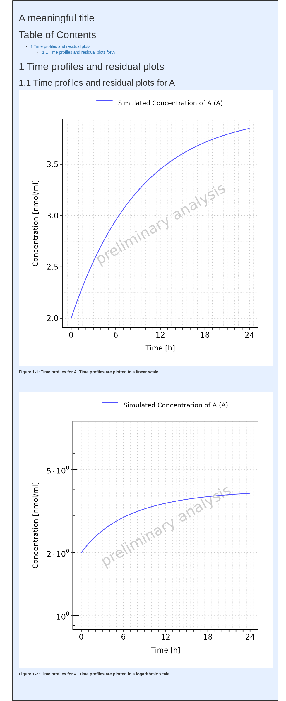
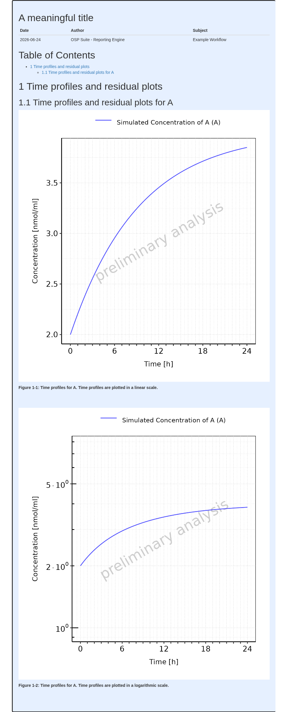

# Add a title page to your workflow report

``` r

require(ospsuite.reportingengine)
#> Loading required package: ospsuite.reportingengine
#> Loading required package: tlf
#> Loading required package: ospsuite
#> 
#> Attaching package: 'ospsuite'
#> The following object is masked from 'package:tlf':
#> 
#>     plotTimeProfile
#> Warning: replacing previous import 'ospsuite::plotTimeProfile' by
#> 'tlf::plotTimeProfile' when loading 'ospsuite.reportingengine'
```

In Mean Model and Population workflows, title pages can be included
using the **`reportTitle`** input argument.

The example below will be used to illustrate the available options when
adding a title page to the final report.

**Code**

``` r

# Get the pkml simulation file: "MiniModel2.pkml"
simulationFile <- system.file("extdata", "MiniModel2.pkml",
  package = "ospsuite.reportingengine"
)

# Define the input parameters
outputA <- Output$new(
  path = "Organism|A|Concentration in container",
  displayName = "Concentration of A",
  displayUnit = "nmol/ml"
)

setA <- SimulationSet$new(
  simulationSetName = "A",
  simulationFile = simulationFile,
  outputs = outputA
)
```

## Add a title only

When only a title is needed as a title page, the workflow will
internally add the markdown title tag, **`"#"`**, to the
**`reportTitle`** as illustrated below.

**Code**

``` r

# Create the workflow instance with the report title
workflow <-
  MeanModelWorkflow$new(
    simulationSets = setA,
    workflowFolder = "Example-1",
    reportTitle = "A meaningful title"
  )
#> 24/06/2026 - 16:04:35
#> i Info  Reporting Engine Information:
#>  Date: 24/06/2026 - 16:04:35
#>  User Information:
#>  Computer Name: runnervm08nci
#>  User: runner
#>  Login: unknown
#>  System is NOT validated
#>  System versions:
#>  R version: R version 4.6.0 (2026-04-24)
#>  OSP Suite Package version: 12.4.3.9011
#>  OSP Reporting Engine version: 2.4.0.9006
#>  tlf version: 1.6.2.9001

# Set the workflow tasks to be run
workflow$activateTasks(c("simulate", "plotTimeProfilesAndResiduals"))

# Run the workflow
workflow$runWorkflow()
#> 24/06/2026 - 16:04:35
#> i Info  Starting run of Mean Model Workflow
#> 24/06/2026 - 16:04:35
#> i Info  Starting run of Simulation task
#> 24/06/2026 - 16:04:35
#> i Info  Splitting simulations for parallel run: 1 simulations split into 1 subsets
#> 24/06/2026 - 16:04:35
#> i Info  Starting run of subset simulations
#>   |                                                                              |                                                                      |   0%  |                                                                              |======================================================================| 100%
#> 24/06/2026 - 16:04:36
#> i Info  Simulation task completed in 0 min
#> 24/06/2026 - 16:04:36
#> i Info  Starting run of Plot Time profiles and Residuals task
#> 24/06/2026 - 16:04:36
#> i Info  Starting run of Plot Time profiles and Residuals task for A
#> 24/06/2026 - 16:04:39
#> i Info  Plot Time profiles and Residuals task completed in 0.1 min
#> 24/06/2026 - 16:04:39
#> i Info  Executing: pandoc --embed-resources --standalone --wrap=none --toc --from=markdown+tex_math_dollars+superscript+subscript+raw_attribute --reference-doc="/home/runner/work/_temp/Library/ospsuite.reportingengine/extdata/reference.docx" --resource-path="Example-1" -t docx -o 'Example-1/Report-word.docx' 'Example-1/Report-word.md'
#> 
#> 24/06/2026 - 16:04:39
#> i Info  Mean Model Workflow completed in 0.1 min
```

    #> file:////home/runner/work/OSPSuite.ReportingEngine/OSPSuite.ReportingEngine/vignettes/Example-1/Report.html screenshot completed

**Report**



## Add a title page

When the length of `reportTitle` is longer than 1, the workflow will
assume `reportTitle` is a more advanced title page already formatted for
markdown. In such cases, `reportTitle` will used as is.

In the example below, the content of a more advanced title page is
defined. The corresponding page includes

- A reference anchor that could be linked using
  `[Title page](#title-page)`
- A title with a markdown title tag
- A table (using `kable` for markdown formatting)

**Code**

``` r

titlePage <- c(
  anchor("title-page"),
  "",
  "# A meaningful title",
  "",
  knitr::kable(
    data.frame(
      Date = Sys.Date(),
      Author = "OSP Suite - Reporting Engine",
      Subject = "Example Workflow"
    )
  )
)
```

``` r

# Here, it is more optimal to re-use the previous workflow
# since only the report title page is changed and the same results are used
workflow$inactivateTasks("simulate")

workflow$reportTitle <- titlePage

# Re-run the workflow with the new title page
workflow$runWorkflow()
#> 24/06/2026 - 16:04:42
#> i Info  Starting run of Mean Model Workflow
#> 24/06/2026 - 16:04:42
#> i Info  Starting run of Plot Time profiles and Residuals task
#> 24/06/2026 - 16:04:42
#> i Info  Starting run of Plot Time profiles and Residuals task for A
#> 24/06/2026 - 16:04:44
#> i Info  Plot Time profiles and Residuals task completed in 0 min
#> 24/06/2026 - 16:04:44
#> i Info  Executing: pandoc --embed-resources --standalone --wrap=none --toc --from=markdown+tex_math_dollars+superscript+subscript+raw_attribute --reference-doc="/home/runner/work/_temp/Library/ospsuite.reportingengine/extdata/reference.docx" --resource-path="Example-1" -t docx -o 'Example-1/Report-word.docx' 'Example-1/Report-word.md'
#> 
#> 24/06/2026 - 16:04:44
#> i Info  Mean Model Workflow completed in 0 min
```

    #> file:////home/runner/work/OSPSuite.ReportingEngine/OSPSuite.ReportingEngine/vignettes/Example-1/Report.html screenshot completed

**Report**



## Use a file as title page

Another option is to use a markdown file as cover page. In this case,
the file path can directly be defined in `reportTitle` and the workflow
will internally check that the file exists and include its content.

The example below save the previously defined title page as a file named
:

**Code**

``` r

titlePageFile <- "title-page.md"
write(
  x = titlePage,
  file = titlePageFile
)
```

``` r

# Here, it is more optimal to re-use the previous workflow
# since only the report title page is changed and the same results are used
workflow$reportTitle <- titlePageFile

# Re-run the workflow with the new title page
workflow$runWorkflow()
#> 24/06/2026 - 16:04:46
#> i Info  Starting run of Mean Model Workflow
#> 24/06/2026 - 16:04:46
#> i Info  Starting run of Plot Time profiles and Residuals task
#> 24/06/2026 - 16:04:46
#> i Info  Starting run of Plot Time profiles and Residuals task for A
#> 24/06/2026 - 16:04:48
#> i Info  Plot Time profiles and Residuals task completed in 0 min
#> 24/06/2026 - 16:04:48
#> i Info  Executing: pandoc --embed-resources --standalone --wrap=none --toc --from=markdown+tex_math_dollars+superscript+subscript+raw_attribute --reference-doc="/home/runner/work/_temp/Library/ospsuite.reportingengine/extdata/reference.docx" --resource-path="Example-1" -t docx -o 'Example-1/Report-word.docx' 'Example-1/Report-word.md'
#> 
#> 24/06/2026 - 16:04:48
#> i Info  Mean Model Workflow completed in 0 min
```

    #> file:////home/runner/work/OSPSuite.ReportingEngine/OSPSuite.ReportingEngine/vignettes/Example-1/Report.html screenshot completed

**Report**


**Note**

Note that running the workflow won’t delete the title page. The title
file can be re-used if the workflow needs to be re-run.

``` r

file.exists(titlePageFile)
#> [1] TRUE
```
