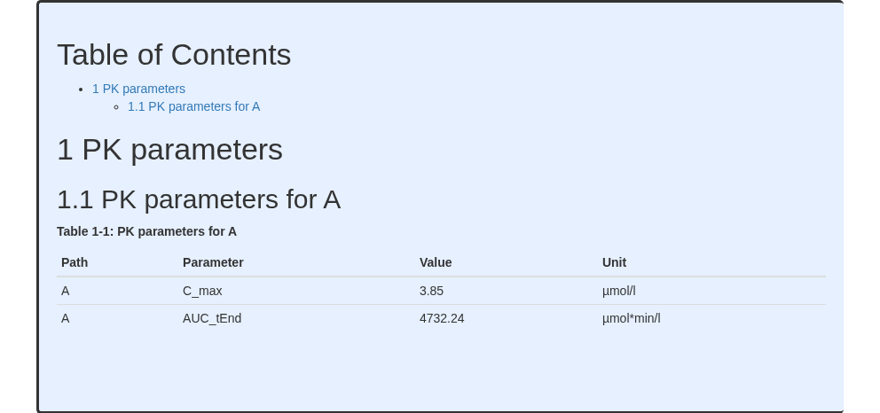
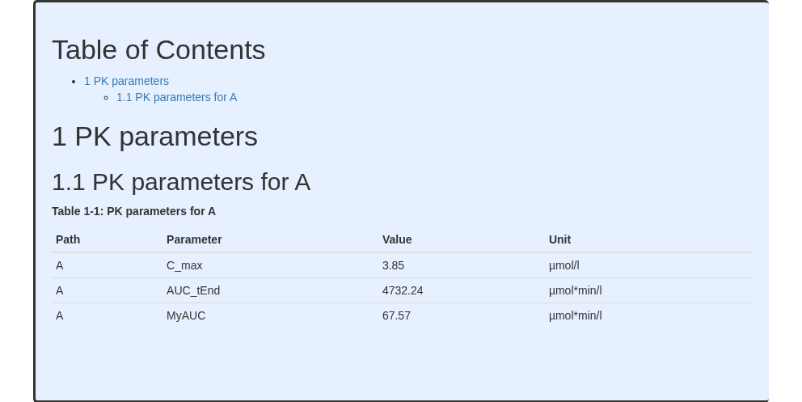
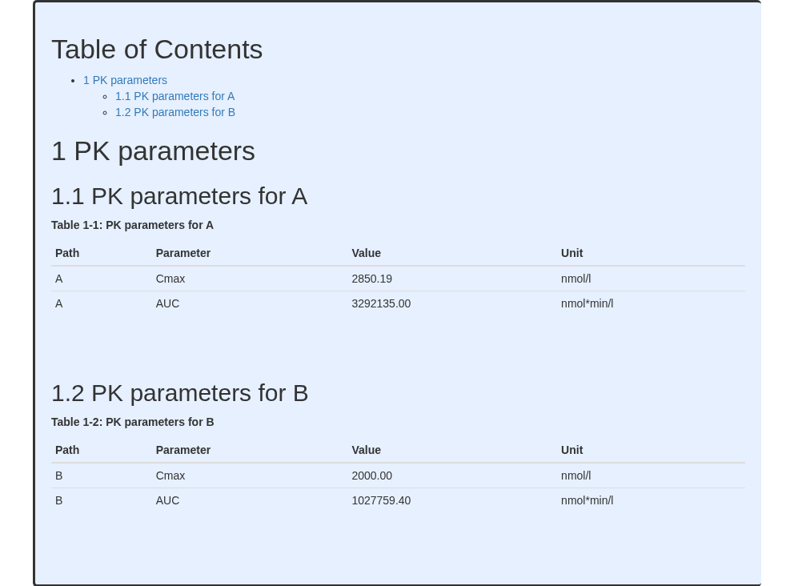
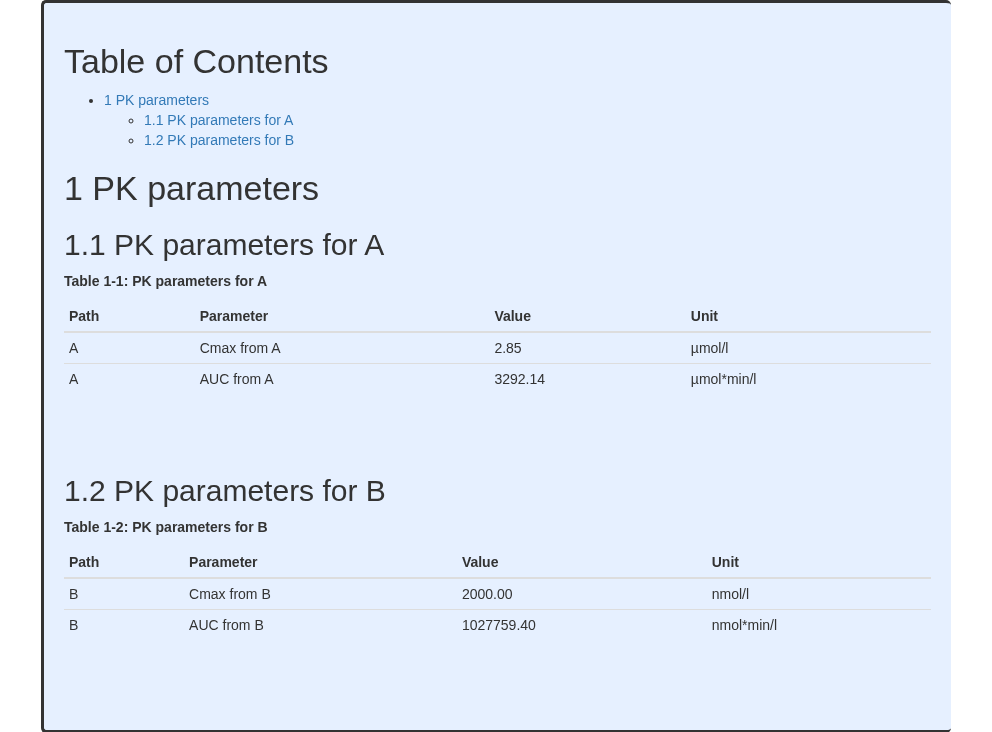

# PK parameters

``` r
require(ospsuite.reportingengine)
#> Loading required package: ospsuite.reportingengine
#> Loading required package: tlf
#> Loading required package: ospsuite
```

This vignette focuses on PK parameters plots and tables generated using
either mean model or population workflows.

## Overview

The PK parameter task aims at generating tables and, when possible,
plots of requested PK parameters. Depending on the workflow type,
different plots and tables can be obtained.

### Inputs

Results obtained from the `calculatePKParameters` task and stored as csv
files within the subdirectory **PKAnalysisResults** from the
`workflowFolder` directory are required in order to perform the PK
parameters (`plotPKParameters`) task. As a consequence, if the workflow
output folder does not include the appropriate simulations, the task
`calculatePKParameters` needs to be **active**.

The objects `SimulationSet` (or `PopulationSimulationSet` for population
workflows) and `Output` define which and how the simulated PK parameters
will be reported.

### Outputs

#### Mean model workflow

For mean model workflows, the PK parameters task generates directly the
table of PK parameters requested in the requested `Output` field
`pkParameters`.

#### Population model workflow

The distribution of the calculated PK parameters for each requested
output are plotted as Box Whisker plots along with a table. By default,
the 5th, 25th, 50th, 75th and 95th percentiles are plotted.

Check the article [PK Parameters in Population
Workflows](https://www.open-systems-pharmacology.org/OSPSuite.ReportingEngine/dev/articles/pop-pk-parameters.md)
for more details

## Template examples

The following sections will introduce template scripts including PK
parameter tasks as well as their associated reports. Table 1 shows the
features tested in each template script. All the examples use Mean Model
Workflows.

| Example | Workflow          | Simulation Sets |
|--------:|:------------------|----------------:|
|       1 | MeanModelWorkflow |               1 |
|       2 | MeanModelWorkflow |               1 |
|       3 | MeanModelWorkflow |               2 |
|       4 | MeanModelWorkflow |               2 |

Table 1: Features tested by each template script

### Example 1

Example 1 shows a basic example of PK parameters performed by a mean
model workflow. In this example, ‘**C_max**’ and ‘**AUC_tEnd**’ are
calculated. Since the task PK parameters requires results from the
folder **PKAnalysisResults**, the tasks `simulate` and
`calculatePKParameters` need to be performed. The task `simulate` needs
to be performed because the task `calculatePKParameters` is using the
time profile simulation results.

**Code**

``` r
# Get the pkml simulation file: "MiniModel2.pkml"
simulationFile <- system.file("extdata", "MiniModel2.pkml",
  package = "ospsuite.reportingengine"
)

# Define the input parameters
outputA <- Output$new(
  path = "Organism|A|Concentration in container",
  displayName = "A",
  pkParameters = c("C_max", "AUC_tEnd")
)

setA <- SimulationSet$new(
  simulationSetName = "A",
  simulationFile = simulationFile,
  outputs = outputA
)

# Create the workflow instance
workflow1 <-
  MeanModelWorkflow$new(
    simulationSets = setA,
    workflowFolder = "Example-1"
  )
#> 16/01/2026 - 14:36:20
#> i Info  Reporting Engine Information:
#>  Date: 16/01/2026 - 14:36:20
#>  User Information:
#>  Computer Name: runnervmmtnos
#>  User: runner
#>  Login: unknown
#>  System is NOT validated
#>  System versions:
#>  R version: R version 4.5.2 (2025-10-31)
#>  OSP Suite Package version: 12.4.1.9001
#>  OSP Reporting Engine version: 2.4.0.9005
#>  tlf version: 1.6.2.9001

# Set the workflow tasks to be run
workflow1$activateTasks(c(
  "simulate",
  "calculatePKParameters",
  "plotPKParameters"
))

# Run the workflow
workflow1$runWorkflow()
#> 16/01/2026 - 14:36:20
#> i Info  Starting run of Mean Model Workflow
#> 16/01/2026 - 14:36:20
#> i Info  Starting run of Simulation task
#> 16/01/2026 - 14:36:20
#> i Info  Splitting simulations for parallel run: 1 simulations split into 1 subsets
#> 16/01/2026 - 14:36:20
#> i Info  Starting run of subset simulations
#>   |                                                                              |                                                                      |   0%  |                                                                              |======================================================================| 100%
#> 16/01/2026 - 14:36:21
#> i Info  Simulation task completed in 0 min
#> 16/01/2026 - 14:36:21
#> i Info  Starting run of Calculate PK Parameters task
#>   |                                                                              |                                                                      |   0%
#> 16/01/2026 - 14:36:21
#> i Info  Starting run of Calculate PK Parameters task for A
#>   |                                                                              |======================================================================| 100%
#> 
#> 16/01/2026 - 14:36:21
#> i Info  Calculate PK Parameters task completed in 0 min
#> 16/01/2026 - 14:36:21
#> i Info  Starting run of Plot PK Parameters task
#> 16/01/2026 - 14:36:21
#> i Info  Starting run of Plot PK Parameters task for A
#> 16/01/2026 - 14:36:21
#> i Info  Plot PK Parameters task completed in 0 min
#> 16/01/2026 - 14:36:21
#> i Info  Executing: pandoc --embed-resources --standalone --wrap=none --toc --from=markdown+tex_math_dollars+superscript+subscript+raw_attribute --reference-doc="/home/runner/work/_temp/Library/ospsuite.reportingengine/extdata/reference.docx" --resource-path="Example-1" -t docx -o 'Example-1/Report-word.docx' 'Example-1/Report-word.md'
#> 
#> 16/01/2026 - 14:36:21
#> i Info  Mean Model Workflow completed in 0 min
```

The output report for Example 1 is shown below. The table indicates the
requested parameters in their base unit.

    #> file:////home/runner/work/OSPSuite.ReportingEngine/OSPSuite.ReportingEngine/vignettes/Example-1/Report.html screenshot completed

**Report**



### Example 2

Example 2 shows how to perform workflows with user defined PK
parameters. In this example, ‘**MyAUC**’ is added to the list of PK
parameters. To create user defined PK parameter, the function
**addUserDefinedPKParameter()** from the `ospsuite` package needs to be
used.

**Code**

``` r
# Get the pkml simulation file: "MiniModel2.pkml"
simulationFile <- system.file("extdata", "MiniModel2.pkml",
  package = "ospsuite.reportingengine"
)

myAUC <- addUserDefinedPKParameter(name = "MyAUC", standardPKParameter = StandardPKParameter$AUC_tEnd)
myAUC$startTime <- 50
myAUC$endTime <- 80

# Define the input parameters
outputA <- Output$new(
  path = "Organism|A|Concentration in container",
  displayName = "A",
  pkParameters = c("C_max", "AUC_tEnd", "MyAUC")
)

setA <- SimulationSet$new(
  simulationSetName = "A",
  simulationFile = simulationFile,
  outputs = outputA
)

# Create the workflow instance
workflow2 <-
  MeanModelWorkflow$new(
    simulationSets = setA,
    workflowFolder = "Example-2"
  )
#> 16/01/2026 - 14:36:23
#> i Info  Reporting Engine Information:
#>  Date: 16/01/2026 - 14:36:23
#>  User Information:
#>  Computer Name: runnervmmtnos
#>  User: runner
#>  Login: unknown
#>  System is NOT validated
#>  System versions:
#>  R version: R version 4.5.2 (2025-10-31)
#>  OSP Suite Package version: 12.4.1.9001
#>  OSP Reporting Engine version: 2.4.0.9005
#>  tlf version: 1.6.2.9001

# Set the workflow tasks to be run
workflow2$activateTasks(c(
  "simulate",
  "calculatePKParameters",
  "plotPKParameters"
))

# Run the workflow
workflow2$runWorkflow()
#> 16/01/2026 - 14:36:23
#> i Info  Starting run of Mean Model Workflow
#> 16/01/2026 - 14:36:23
#> i Info  Starting run of Simulation task
#> 16/01/2026 - 14:36:23
#> i Info  Splitting simulations for parallel run: 1 simulations split into 1 subsets
#> 16/01/2026 - 14:36:23
#> i Info  Starting run of subset simulations
#>   |                                                                              |                                                                      |   0%  |                                                                              |======================================================================| 100%
#> 16/01/2026 - 14:36:24
#> i Info  Simulation task completed in 0 min
#> 16/01/2026 - 14:36:24
#> i Info  Starting run of Calculate PK Parameters task
#>   |                                                                              |                                                                      |   0%
#> 16/01/2026 - 14:36:24
#> i Info  Starting run of Calculate PK Parameters task for A
#>   |                                                                              |======================================================================| 100%
#> 
#> 16/01/2026 - 14:36:24
#> i Info  Calculate PK Parameters task completed in 0 min
#> 16/01/2026 - 14:36:24
#> i Info  Starting run of Plot PK Parameters task
#> 16/01/2026 - 14:36:24
#> i Info  Starting run of Plot PK Parameters task for A
#> 16/01/2026 - 14:36:24
#> i Info  Plot PK Parameters task completed in 0 min
#> 16/01/2026 - 14:36:24
#> i Info  Executing: pandoc --embed-resources --standalone --wrap=none --toc --from=markdown+tex_math_dollars+superscript+subscript+raw_attribute --reference-doc="/home/runner/work/_temp/Library/ospsuite.reportingengine/extdata/reference.docx" --resource-path="Example-2" -t docx -o 'Example-2/Report-word.docx' 'Example-2/Report-word.md'
#> 
#> 16/01/2026 - 14:36:24
#> i Info  Mean Model Workflow completed in 0 min
```

The output report for Example 2 is shown below. The table indicates the
requested parameters in their base unit.

    #> file:////home/runner/work/OSPSuite.ReportingEngine/OSPSuite.ReportingEngine/vignettes/Example-2/Report.html screenshot completed

**Report**



### Example 3

Example 3 shows a similar example with 2 simulation sets. In this
example, the names and units of the PK parameters are updated using the
function **updatePKParameter** from the `ospsuite` package.

**Code**

``` r
# Get the pkml simulation file: "MiniModel2.pkml"
simulationFileA <- system.file("extdata", "MiniModel1.pkml",
  package = "ospsuite.reportingengine"
)

simulationFileB <- system.file("extdata", "MiniModel2.pkml",
  package = "ospsuite.reportingengine"
)

updatePKParameter("C_max",
  displayName = "Cmax",
  displayUnit = "nmol/l"
)
#> <PKParameter>
#>   • Name: C_max
#>   • DisplayName: Cmax
#>   • Dimension: Concentration (molar)
#>   • DisplayUnit: nmol/l
updatePKParameter("AUC_tEnd",
  displayName = "AUC",
  displayUnit = "nmol*min/l"
)
#> <PKParameter>
#>   • Name: AUC_tEnd
#>   • DisplayName: AUC
#>   • Dimension: AUC (molar)
#>   • DisplayUnit: nmol*min/l

# Define the input parameters
outputA <- Output$new(
  path = "Organism|A|Concentration in container",
  displayName = "A",
  pkParameters = c("C_max", "AUC_tEnd")
)
outputB <- Output$new(
  path = "Organism|B|Concentration in container",
  displayName = "B",
  pkParameters = c("C_max", "AUC_tEnd")
)

setA <- SimulationSet$new(
  simulationSetName = "A",
  simulationFile = simulationFileA,
  outputs = outputA
)
setB <- SimulationSet$new(
  simulationSetName = "B",
  simulationFile = simulationFileB,
  outputs = outputB
)

# Create the workflow instance
workflow3 <-
  MeanModelWorkflow$new(
    simulationSets = c(setA, setB),
    workflowFolder = "Example-3"
  )
#> 16/01/2026 - 14:36:26
#> i Info  Reporting Engine Information:
#>  Date: 16/01/2026 - 14:36:26
#>  User Information:
#>  Computer Name: runnervmmtnos
#>  User: runner
#>  Login: unknown
#>  System is NOT validated
#>  System versions:
#>  R version: R version 4.5.2 (2025-10-31)
#>  OSP Suite Package version: 12.4.1.9001
#>  OSP Reporting Engine version: 2.4.0.9005
#>  tlf version: 1.6.2.9001

# Set the workflow tasks to be run
workflow3$activateTasks(c(
  "simulate",
  "calculatePKParameters",
  "plotPKParameters"
))

# Run the workflow
workflow3$runWorkflow()
#> 16/01/2026 - 14:36:26
#> i Info  Starting run of Mean Model Workflow
#> 16/01/2026 - 14:36:26
#> i Info  Starting run of Simulation task
#> 16/01/2026 - 14:36:26
#> i Info  Splitting simulations for parallel run: 2 simulations split into 1 subsets
#> 16/01/2026 - 14:36:26
#> i Info  Starting run of subset simulations
#>   |                                                                              |                                                                      |   0%  |                                                                              |======================================================================| 100%
#> 16/01/2026 - 14:36:26
#> i Info  Simulation task completed in 0 min
#> 16/01/2026 - 14:36:26
#> i Info  Starting run of Calculate PK Parameters task
#>   |                                                                              |                                                                      |   0%
#> 16/01/2026 - 14:36:26
#> i Info  Starting run of Calculate PK Parameters task for A
#>   |                                                                              |===================================                                   |  50%
#> 16/01/2026 - 14:36:26
#> i Info  Starting run of Calculate PK Parameters task for B
#>   |                                                                              |======================================================================| 100%
#> 
#> 16/01/2026 - 14:36:26
#> i Info  Calculate PK Parameters task completed in 0 min
#> 16/01/2026 - 14:36:26
#> i Info  Starting run of Plot PK Parameters task
#> 16/01/2026 - 14:36:26
#> i Info  Starting run of Plot PK Parameters task for A
#> 16/01/2026 - 14:36:27
#> i Info  Starting run of Plot PK Parameters task for B
#> 16/01/2026 - 14:36:27
#> i Info  Plot PK Parameters task completed in 0 min
#> 16/01/2026 - 14:36:27
#> i Info  Executing: pandoc --embed-resources --standalone --wrap=none --toc --from=markdown+tex_math_dollars+superscript+subscript+raw_attribute --reference-doc="/home/runner/work/_temp/Library/ospsuite.reportingengine/extdata/reference.docx" --resource-path="Example-3" -t docx -o 'Example-3/Report-word.docx' 'Example-3/Report-word.md'
#> 
#> 16/01/2026 - 14:36:27
#> i Info  Mean Model Workflow completed in 0 min
```

The output report for Example 3 is shown below. The table indicates the
requested parameters in the updated units and display names.

    #> file:////home/runner/work/OSPSuite.ReportingEngine/OSPSuite.ReportingEngine/vignettes/Example-3/Report.html screenshot completed

**Report**



### Example 4

Example 4 shows a different way of updating the PK parameters using the
instance **PkParameterInfo**. Using that instance, it is possible to
define different names and units for the same parameters from different
paths or simulations.

**Code**

``` r
# Get the pkml simulation file: "MiniModel2.pkml"
simulationFile <- system.file("extdata", "MiniModel2.pkml",
  package = "ospsuite.reportingengine"
)

CmaxA <- PkParameterInfo$new("C_max",
  displayName = "Cmax from A",
  displayUnit = "µmol/l"
)
CmaxB <- PkParameterInfo$new("C_max",
  displayName = "Cmax from B",
  displayUnit = "nmol/l"
)
AUCA <- PkParameterInfo$new("AUC_tEnd",
  displayName = "AUC from A",
  displayUnit = "µmol*min/l"
)
AUCB <- PkParameterInfo$new("AUC_tEnd",
  displayName = "AUC from B",
  displayUnit = "nmol*min/l"
)

# Define the input parameters
outputA <- Output$new(
  path = "Organism|A|Concentration in container",
  displayName = "A",
  pkParameters = c(CmaxA, AUCA)
)
outputB <- Output$new(
  path = "Organism|B|Concentration in container",
  displayName = "B",
  pkParameters = c(CmaxB, AUCB)
)

setA <- SimulationSet$new(
  simulationSetName = "A",
  simulationFile = simulationFile,
  outputs = outputA
)
setB <- SimulationSet$new(
  simulationSetName = "B",
  simulationFile = simulationFile,
  outputs = outputB
)

# Create the workflow instance
workflow4 <-
  MeanModelWorkflow$new(
    simulationSets = c(setA, setB),
    workflowFolder = "Example-3"
  )
#> 16/01/2026 - 14:36:28
#> i Info  Reporting Engine Information:
#>  Date: 16/01/2026 - 14:36:28
#>  User Information:
#>  Computer Name: runnervmmtnos
#>  User: runner
#>  Login: unknown
#>  System is NOT validated
#>  System versions:
#>  R version: R version 4.5.2 (2025-10-31)
#>  OSP Suite Package version: 12.4.1.9001
#>  OSP Reporting Engine version: 2.4.0.9005
#>  tlf version: 1.6.2.9001

# Set the workflow tasks to be run
workflow4$activateTasks("plotPKParameters")
workflow4$inactivateTasks(c("simulate", "calculatePKParameters"))

# Run the workflow
workflow4$runWorkflow()
#> 16/01/2026 - 14:36:28
#> i Info  Starting run of Mean Model Workflow
#> 16/01/2026 - 14:36:28
#> i Info  Starting run of Plot PK Parameters task
#> 16/01/2026 - 14:36:28
#> i Info  Starting run of Plot PK Parameters task for A
#> 16/01/2026 - 14:36:28
#> i Info  Starting run of Plot PK Parameters task for B
#> 16/01/2026 - 14:36:28
#> i Info  Plot PK Parameters task completed in 0 min
#> 16/01/2026 - 14:36:28
#> i Info  Executing: pandoc --embed-resources --standalone --wrap=none --toc --from=markdown+tex_math_dollars+superscript+subscript+raw_attribute --reference-doc="/home/runner/work/_temp/Library/ospsuite.reportingengine/extdata/reference.docx" --resource-path="Example-3" -t docx -o 'Example-3/Report-word.docx' 'Example-3/Report-word.md'
#> 
#> 16/01/2026 - 14:36:28
#> i Info  Mean Model Workflow completed in 0 min
```

The output report for Example 4 is shown below. The table indicates the
requested parameters in the updated units and display names.

    #> file:////home/runner/work/OSPSuite.ReportingEngine/OSPSuite.ReportingEngine/vignettes/Example-3/Report.html screenshot completed

**Report**


