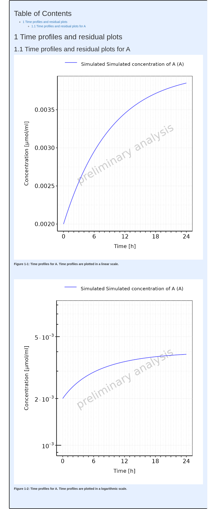

# Plot settings

``` r

require(ospsuite.reportingengine)
#> Loading required package: ospsuite.reportingengine
#> Loading required package: tlf
#> Loading required package: ospsuite
#> 
#> Attaching package: 'ospsuite'
#> The following object is masked from 'package:tlf':
#> 
#>     plotTimeProfile
#> Warning: replacing previous import 'ospsuite::plotTimeProfile' by
#> 'tlf::plotTimeProfile' when loading 'ospsuite.reportingengine'
```

## Overview

This vignette provides some guidance to define properties and settings
for the reporting engine.

These properties can at 2 levels:

- Global or workflow plot configuration, affecting every plot of the
  workflow output
- Local or task plot configuration, affecting specific plots within a
  task

## How to set global workflow properties

Reporting Engine global setting names are listed in the enum
[`reSettingsNames`](https://www.open-systems-pharmacology.org/OSPSuite.ReportingEngine/dev/reference/reSettingsNames.md).
Each global setting can be reviewed using the function
[`getRESettings()`](https://www.open-systems-pharmacology.org/OSPSuite.ReportingEngine/dev/reference/getRESettings.md).

It is possible to update, save and reuse most of the reporting engine
default settings using the functions available in the section [**Default
Settings**](https://www.open-systems-pharmacology.org/OSPSuite.ReportingEngine/dev/reference/index.html#default-settings).

Note that the function
[`resetRESettingsToDefault()`](https://www.open-systems-pharmacology.org/OSPSuite.ReportingEngine/dev/reference/resetRESettingsToDefault.md)
allows you to reset to initial default values defined by the reporting
engine.

### Notion of theme

A theme is an object of R6 class `Theme` which defines the default
properties used to build every plot in `tlf` package. More information
can be found directly within the documentation of the the `tlf` package
(vignettes **“theme-maker”** and **“plot-configuration”**).

The best workflow to set a `Theme` object is to use json files.
Templates of json files are available in the `tlf` package at the
location defined below:

``` r

# Get the path of the Json template
jsonFile <- system.file("extdata", "re-theme.json",
  package = "ospsuite.reportingengine"
)

# Load the theme from the json file
reTheme <- tlf::loadThemeFromJson(jsonFile)
```

Modifications of the theme properties can be done directly by updating
the properties of the `Theme` object as shown below:

``` r

# Overwrite the current background fill
reTheme$background$panel$fill <- "white"
reTheme$background$panel$fill
#> [1] "white"
```

To save the updated `Theme` object, the function `saveThemeToJson`
provided by `tlf` package can be used.

``` r

# Save your updated theme in "my-new-theme.json"
tlf::saveThemeToJson("my-new-theme.json", theme = reTheme)
```

In addition, the `tlf` package provides a Shiny app to define and save
your own theme with a few clicks:
**[`tlf::runThemeMaker()`](https://rdrr.io/pkg/tlf/man/runThemeMaker.html)**.

Then, the most important step is to define the `Theme` object as the
current default for the workflow. In `ospsuite.reportingengine`, this
can be either achieved using the function `setDefaultTheme` with a
`Theme` object as shown in the example below with **`reTheme`**.

The properties defined by the `Theme` object will be used by default if
no specific plot configurations are provided for the workflow plots.

``` r

# Set reTheme as current default Theme
setDefaultTheme(reTheme)
```

**Caution**: loading a workflow re-initialize the default theme. The
function
[`setDefaultTheme()`](https://www.open-systems-pharmacology.org/OSPSuite.ReportingEngine/dev/reference/setDefaultTheme.md)
needs to be called after initialization of the workflow.

Additionally, `Workflow` objects have a `theme` input argument available
in method `$new()` to use the input theme instead of the reporting
engine default.

### Exporting plots in a specific format

One important global setting is the format of the figure files
(e.g. png, jpg or pdf) as well as the quality of the figures. By
default, the figures are saved as png files with a size of 20 x 15 cm.
The format settings can be managed using the function
**[`setDefaultPlotFormat()`](https://www.open-systems-pharmacology.org/OSPSuite.ReportingEngine/dev/reference/setDefaultPlotFormat.md)**
as illustrated below, input arguments are `format`, `width`, `height`,
their `units` and the plot resolution `dpi`.

``` r

setDefaultPlotFormat(format = "png")
```

### Watermark

Watermark corresponds to text in the background of plots. Watermark font
properties can be set in the `Theme` object: `reTheme$fonts$watermark`.

Regarding the content of the watermark, the default content available in
the `Theme` object (i.e. at `reTheme$background$watermark` in the
example) is overwritten by the `Workflow` objects:

- If a system is validated, no text is printed in background by default.
- If a system is **NOT** validated, the text ***“preliminary results”***
  is printed in background by default.

As a consequence, setting the watermark content needs to be performed
directly with the `Workflow` objects: either when initializing the
workflow using the input argument `watermark`
(e.g. `MeanModelWorkflow$new(..., watermark = "vignette example")`); or
using the workflow method **`$setWatermark(watermark)`**
(e.g. `myWorkflow$setWatermark("vignette example")`).

The workflow method **`$getWatermark()`** prints the watermark text
which will be in the background of the figures output by the workflow
(e.g. `myWorkflow$getWatermark()`).

**Note**: The **NULL** input argument for watermark leads to using the
default watermark feature.

## How to set task specific properties

Each task of `Workflow` objects includes a field named **`settings`**.
This optional field of class `TaskSettings` can be updated and will
overwrite the default behavior of a task.

Two usual subfields of **`settings`** are: **`plotConfigurations`** and
**`bins`**. Other settings can also be provided and will be detailed in
the next sections.

- **`plotConfigurations`** is a list of `PlotConfiguration` objects from
  the `tlf` package. `PlotConfiguration` is an R6 class in which plot
  properties are stored and used to create plots with a desired
  configuration. More information can be found on this notion within the
  `tlf` vignette **“plot-configuration”**. Providing a user-defined
  `PlotConfiguration` object to this input list will overwrite the
  default configuration and will be used to generate the task
  corresponding task plot(s).
- **`bins`** can be a number, a vector or a function which will be used
  to bin histograms.

The next section will provide the names of the plots and options that
can be accessed through the field **`settings`**.

### Time profiles and residuals

Regardless of the workflow subclass (`MeanModelWorkflow` or
`PopulationWorkflow`), the names in the **`plotConfigurations`** list
available for the **“plotTimeProfilesAndResiduals”** task are the
following:

- **“timeProfile”**: for time profile plots in linear and log scale
- **“obsVsPred”**: for observed vs simulated data in linear and log
  scale
- **“resVsPred”**: for residuals vs simulated data plots
- **“resVsTime”**: for residuals vs time plots
- **“resHisto”**: for histograms of residuals
- **“resQQPlot”**: for qq-plots of residuals
- **“histogram”**: for histograms of residuals across all simulations
- **“qqPlot”**: for qq-plots of residuals across all simulations

Since histograms are performed by the task, **`bins`** can also be
defined.

Displayed names and units are usually managed through the
**`SimulationSet`** and **`Output`** objects. The vignette
**“goodness-of-fit”** provides more details about the
**“plotTimeProfilesAndResiduals”** task.

**Example**: below shows a typical mean model workflow example in which
**`plotConfigurations`** and **`bins`** are set for a
**“plotTimeProfilesAndResiduals”** task.

``` r

# Get the pkml simulation file: "MiniModel2.pkml"
simulationFile <- system.file("extdata", "MiniModel2.pkml",
  package = "ospsuite.reportingengine"
)

# Define the output object
outputA <- Output$new(
  path = "Organism|A|Concentration in container",
  displayName = "Simulated concentration of A",
  displayUnit = "µmol/ml"
)

# Define the simulation set object
setA <- SimulationSet$new(
  simulationSetName = "A",
  simulationFile = simulationFile,
  outputs = outputA
)

# Create the workflow object
workflowA <-
  MeanModelWorkflow$new(
    simulationSets = setA,
    workflowFolder = "Example-A"
  )
#> 24/06/2026 - 16:09:52
#> i Info  Reporting Engine Information:
#>  Date: 24/06/2026 - 16:09:52
#>  User Information:
#>  Computer Name: runnervm08nci
#>  User: runner
#>  Login: unknown
#>  System is NOT validated
#>  System versions:
#>  R version: R version 4.6.0 (2026-04-24)
#>  OSP Suite Package version: 12.4.3.9011
#>  OSP Reporting Engine version: 2.4.0.9006
#>  tlf version: 1.6.2.9001

# Set the workflow tasks to be run
workflowA$activateTasks(c("simulate", "plotTimeProfilesAndResiduals"))
```

The next chunk of code will define `PlotConfiguration` objects to be
included in **`settings`**:

``` r

# Define plot configuration for obsVsPred
obsVsPredConfiguration <- PlotConfiguration$new(
  xlabel = "Observed values [µmol/ml]",
  ylabel = "Simulated values [µmol/ml]",
  watermark = "vignette"
)

# Define plot configuration for resHisto
resHistoConfiguration <- PlotConfiguration$new(
  xlabel = "Residuals",
  ylabel = "Count",
  watermark = "vignette"
)

# Update some fields of the configuration if necessary
resHistoConfiguration$background$plot$fill <- "lemonchiffon"
resHistoConfiguration$background$panel$fill <- "lemonchiffon"
resHistoConfiguration$background$panel$color <- "goldenrod3"
resHistoConfiguration$background$xGrid$color <- "goldenrod3"
resHistoConfiguration$background$yGrid$color <- "goldenrod3"

# Define plotConfigurations list
plotConfigurations <- list(
  resHisto = resHistoConfiguration,
  obsVsPred = obsVsPredConfiguration
)

# Define list to update task settings with plotConfigurations field and and bins field
mySettings <- list(
  plotConfigurations = plotConfigurations,
  bins = 3
)
```

Then, the **`settings`** field of the **“plotTimeProfilesAndResiduals”**
task can be updated as shown below:

``` r

# Run the workflow
workflowA$plotTimeProfilesAndResiduals$settings <- mySettings
```

The run of the workflow with updated settings and get the resulting
report as shown below.

Since the histogram across the all simulations did not get the plot
configuration settings defined for individual simulations, the plots are
quite different. However, the option **`bins`** is currently set among
all plots of the task. Regarding observed vs simulated plots, the got
the updated xlabel, ylabel and watermark as defined in the plot
configuration.

``` r

# Run the workflow
workflowA$runWorkflow()
#> 24/06/2026 - 16:09:53
#> i Info  Starting run of Mean Model Workflow
#> 24/06/2026 - 16:09:53
#> i Info  Starting run of Simulation task
#> 24/06/2026 - 16:09:53
#> i Info  Splitting simulations for parallel run: 1 simulations split into 1 subsets
#> 24/06/2026 - 16:09:53
#> i Info  Starting run of subset simulations
#>   |                                                                              |                                                                      |   0%  |                                                                              |======================================================================| 100%
#> 24/06/2026 - 16:09:53
#> i Info  Simulation task completed in 0 min
#> 24/06/2026 - 16:09:53
#> i Info  Starting run of Plot Time profiles and Residuals task
#> 24/06/2026 - 16:09:53
#> i Info  Starting run of Plot Time profiles and Residuals task for A
#> 24/06/2026 - 16:09:56
#> i Info  Plot Time profiles and Residuals task completed in 0 min
#> 24/06/2026 - 16:09:56
#> i Info  Executing: pandoc --embed-resources --standalone --wrap=none --toc --from=markdown+tex_math_dollars+superscript+subscript+raw_attribute --reference-doc="/home/runner/work/_temp/Library/ospsuite.reportingengine/extdata/reference.docx" --resource-path="Example-A" -t docx -o 'Example-A/Report-word.docx' 'Example-A/Report-word.md'
#> 
#> 24/06/2026 - 16:09:56
#> i Info  Mean Model Workflow completed in 0.1 min
```

    #> file:////home/runner/work/OSPSuite.ReportingEngine/OSPSuite.ReportingEngine/vignettes/Example-A/Report.html screenshot completed

**Report**



### PK parameters plots

Selection, displayed names and units are usually managed through the
`ospsuite` **`PKParameters`** objects or **`PkParametersInfo`** objects.
The vignette **“pk-parameters”** provides more details about the
**“plotPKParameters”** task.

For mean model workflows, the PK parameters are only summarized as
tables. In the current version, there is no option for number of decimal
numbers to set.

For population workflows, the parameters are described using plots which
depends on the population workflow type. The names in the
**`plotConfigurations`** list available for the **“plotPKParameters”**
task are the following:

- **“boxplotPkParameters”**: for boxplots of PK parameters performed by
  parallel comparison and ratio types of population workflows
- **“boxplotPkRatios”**: for boxplots of PK parameters ratios performed
  by ratio type of population workflows
- **“vpcParameterPlot”**: for VPC like plots of PK parameters vs
  Demography parameters performed by pediatric type of population
  workflows
- **“comparisonVpcPlot”**: for VPC like plots of PK parameters vs
  Demography parameters comparing to reference population performed by
  pediatric type

Since pediatric workflows perform VPC like plot, aggregation of the data
is performed along the demography parameters. The binning of the
demography parameters can be set by the optional field **`bins`** from
the task field **`settings`**. This field can be either a unique value
corresponding to the number of bins or a vector defining the bin edges
for all the demography parameter paths.

Besides, the final plot can either link the aggregated values or plot
them as stairstep. The default behaviour is to perform a stairstep plot,
but this can be tuned with the optional field **`stairstep`**
(`TRUE`/`FALSE`) from the task field **`settings`**.

Below shows examples of how to set such options:

``` r

# Associate the bin edges
workflowA$plotPKParameters$settings$bins <- c(0, 1, 2, 3, 5, 10)

# Associate the number of bins
workflowA$plotPKParameters$settings$bins <- 15

# Set VPC as stair step
workflowA$plotPKParameters$settings$stairstep <- TRUE
```

### Sensitivity plots

Settings for the sensitivity plots are **`SensitivityPlotSettings`**
objects. The vignette **“sensitivity-analysis”** provides more details
about the **“plotSensitivity”** task.

The input argument of the **`SensitivityPlotSettings`** settings object
are then (to be created using `SensitivityPlotSettings$new()`):

- **`totalSensitivityThreshold`**: cut-off used for plots of the most
  sensitive parameters; default is **0.9**.
- **`variableParameterPaths`**: paths that were varied in the
  sensitivity analysis. If supplied **`totalSensitivityThreshold`** is
  1, else it uses the default or user-provided value.
- **`maximalParametersPerSensitivityPlot`**: maximal number of
  parameters to display in a sensitivity plot. By default, the maximal
  number of parameters to display is **50**.
- **`plotConfiguration`**: `PlotConfiguration` object from `tlf` library
- **`xAxisFontSize`**: Font size of x-axis labels for sensitivity plot,
  that can overwrite behavior of **`plotConfiguration`**. Default font
  size is 6.
- **`yAxisFontSize`**: Font size of y-axis labels for sensitivity plot,
  that can overwrite behavior of **`plotConfiguration`**. Default font
  size is 6.
- **`xLabel`** Label of x-axis for sensitivity plot, that can overwrite
  behavior of **`plotConfiguration`**. Default xLabel is
  **“Sensitivity”**.
- **`yLabel`** Label of y-axis for sensitivity plot, that can overwrite
  behavior of **`plotConfiguration`**. Default yLabel is **NULL**.
- **`colorPalette`** Name of a color palette to be used by
  [`ggplot2::scale_fill_brewer()`](https://ggplot2.tidyverse.org/reference/scale_brewer.html)
  for sensitivity plot. Default color palette is **“Spectral”**.

Since displayed sensitivity parameters can include long strings of
characters shrinking the actual plot even using small `yAxisFontSize`,
an algorithm providing line breaks is included in the task to prevent
the shrinking issue as much as possible. Two fields are available in
settings to tune the algorithm:

- **`maxWidthPerParameter`** is the maximum width for the display
  parameters. Parameters longer than that will have line breaks. The
  default maximum width is 25 characters.
- **`maxLinesPerParameter`** is the maximum number of lines for the
  display parameters. The default maximum number of lines is 3. For
  parameters longer than `maxLinesPerParameter*maxWidthPerParameter`,
  only `maxLinesPerParameter` setting will be respected.

### Absorption

The name in the **`plotConfigurations`** list available for the
**“plotAbsorption”** task is the following:

- **“absorptionPlot”**

### Mass Balance

The name in the **`plotConfigurations`** list available for the
**“plotMassBalance”** task is the following:

- **“timeProfile”**: for time profile plots of mass balance in linear
  and log scales
- **“cumulativeTimeProfile”**: for cumulative time profile plots of mass
  balance in linear and log scales
- **“normalizedTimeProfile”**: for normalized time profile plots (as
  fraction of drug mass) of mass balance in linear and log scales
- **“normalizedCumulativeTimeProfile”**: for cumulative normalized time
  profile plots of mass balance in linear and log scales
- **“pieChart”**: for pie chart of mass balance at last simulated time
  point

Another field of **`settings`** is **`selectedCompoundNames`** which
allows to keep only a selected list of compounds to be kept in the mass
balance plots.

### Demography plots

The names in the **`plotConfigurations`** list available for the
**“plotDemography”** task are the following:

- **“histogram”**: for histogram of Demography parameters performed by
  parallel comparison and ratio types of population workflows
- **“vpcParameterPlot”**: for VPC like plots of Demography parameters vs
  Demography parameters performed by pediatric type of population
  workflows
- **“comparisonVpcPlot”**: for VPC like plots of Demography parameters
  vs Demography parameters comparing to reference population performed
  by pediatric type

Since pediatric workflows perform VPC like plot, aggregation of the data
is performed along the demography parameters. The binning of the
demography parameters can be set by the optional field **`bins`** from
the task field **`settings`**. This field can be either a unique value
corresponding to the number of bins or a vector defining the bin edges
for all the demography parameter paths.

Besides, the final plot can either link the aggregated values or plot
them as stairstep. The default behaviour is to perform a stairstep plot,
but this can be tuned with the optional field **`stairstep`**
(`TRUE`/`FALSE`) from the task field **`settings`**.

Similarly, parallel comparison and ratio types of population workflows
perform histograms, whose binning can set using the **`settings`** field
**`bins`**.
