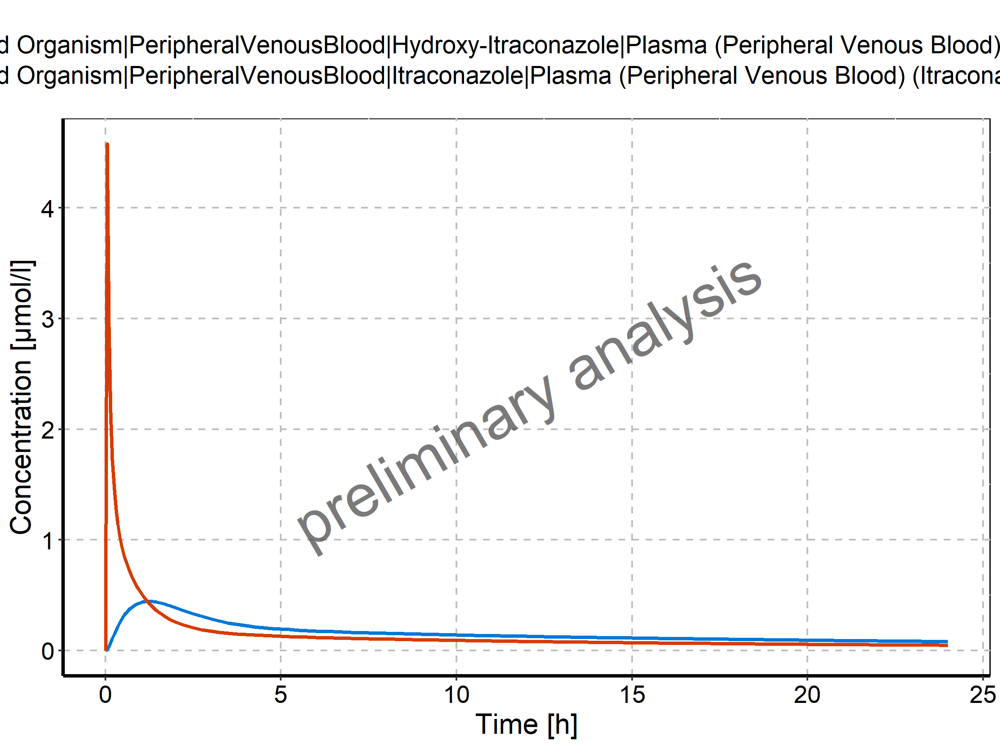
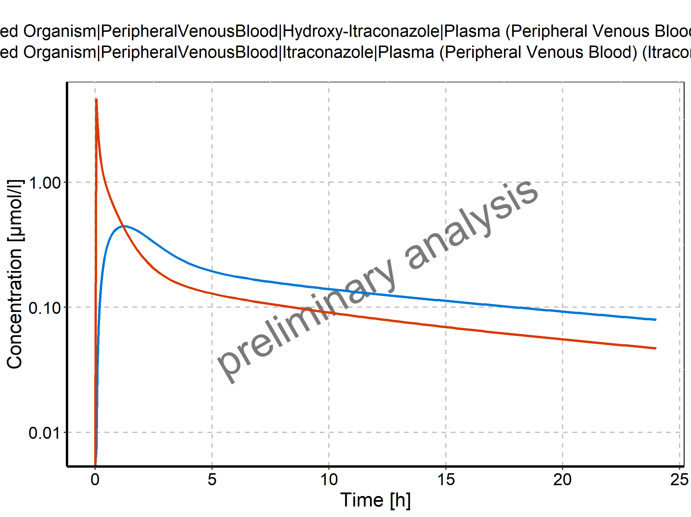
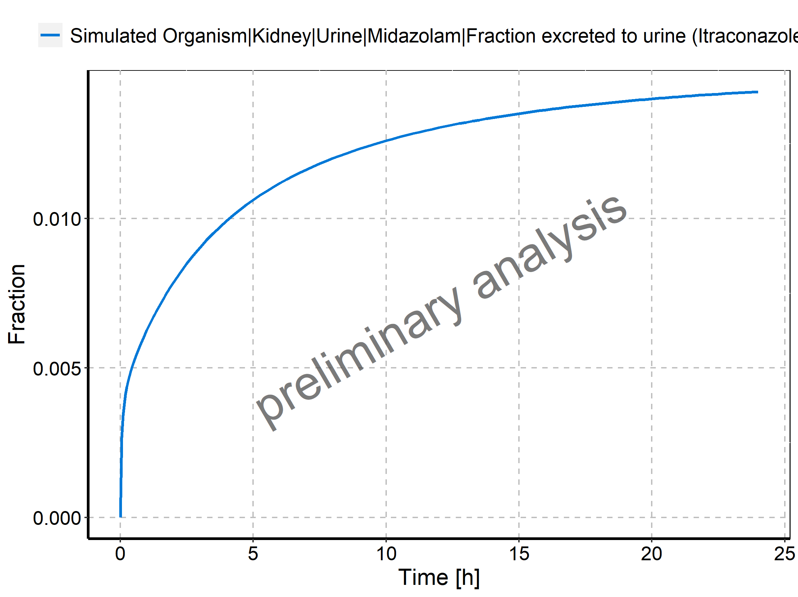
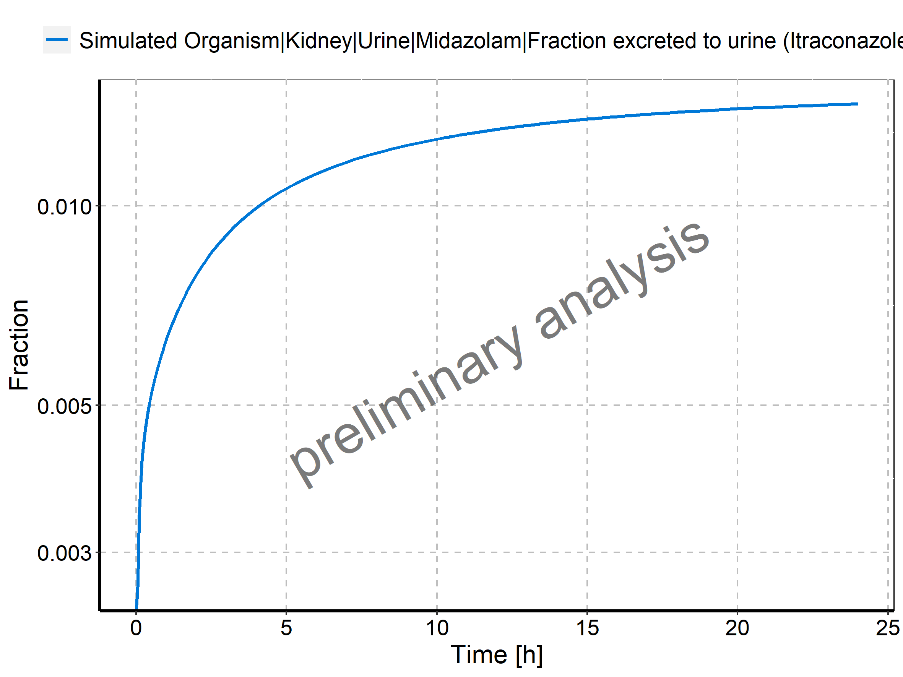

# Time profiles and residual plots

## Time profiles and residual plots for Itraconazole-S1

Figure: Time profiles for Itraconazole-S1. Time profiles are plotted in a linear scale.

Figure: Time profiles for Itraconazole-S1. Time profiles are plotted in a logarithmic scale.

Figure: Time profiles for Itraconazole-S1. Time profiles are plotted in a linear scale.

Figure: Time profiles for Itraconazole-S1. Time profiles are plotted in a logarithmic scale.

