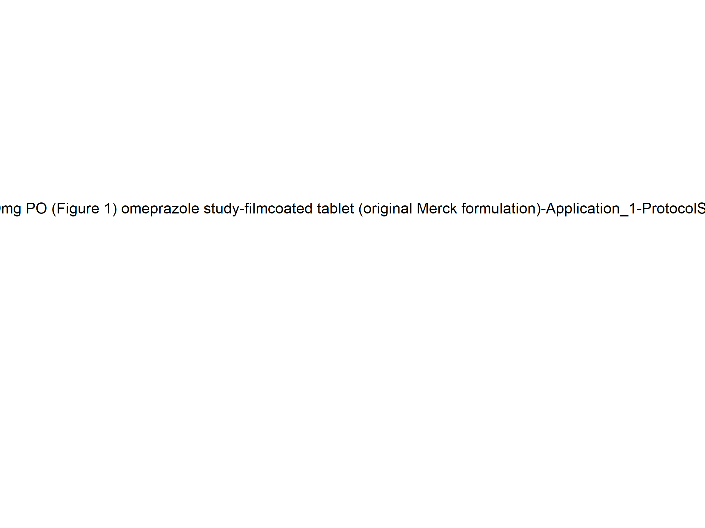

 - [1. Sensitivity Analysis](#1.-sensitivity-analysis)

# 1. Sensitivity Analysis

\newpage
Figure 1: Sensitivity of C_max of Organism|Lung|Interstitial|Raltegravir|Concentration for individuals at percentiles 0.5 in simulation sets 'ral', 'lar'.

