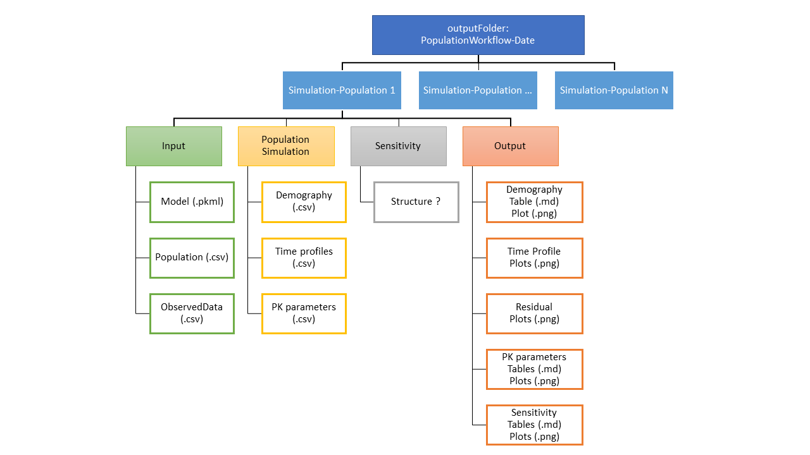

```{r setup, include=FALSE}
setwd("C:/Design2Code/OSPSuite.ReportingEngine/R")
devtools::document()
setwd("C:/Design2Code/OSPSuite.ReportingEngine/tests/dev")
knitr::opts_chunk$set(echo = TRUE)
library(tlf)
library(ospsuite)
library(ospsuite.reportingengine)
```


# Population Workflow
This example of population workflow is performed from `tests/dev` and uses data stored in `tests/data`.
The input data for the worklow are a population file (`populationFile = "../tests/data/pop_10.csv"`) and a simulation file (`simulationFile = "../tests/data/S1.pkml"`).

## Initialization of the population workflow
The initialization of the workflow defines:

1) A structured folder to save input, simulations and output (Fig 1).
2) A list of `tasks` to be performed during the run of the population workflow.
3) Settings for each of the `tasks`.

```{r}
popWorkflow <- PopulationWorkflow$new(
  simulationFile = "../data/S1.pkml",
  populationFile = "../data/pop_10.csv"
)
```

### 1. Output folder and structure
The expected output structure is represented in Fig 1.
The default name of the folder is `Workflow<Current Date>`, this name can be overwritten in the initialization if input (`workflowFolder = ...`).
Within each folder, 4 subfolders are created to stored specific pieces of the workflow. 

- `Inputs` stores the input `population`, `simulation` and if necessary `observed data`.
- `Simulations` stores the results of the population simulations performed from the input.
- `Sensitivities` stores the results of the sensitivity analysis ? (Let me know what is the expected format)
- `Outputs` stores the output plot and table results.

The previous example created such a structure:
```{r, results='asis', echo=FALSE}
knitr::kable(data.frame("Current Folder Structure" = list.dirs(), check.names = FALSE))
```

```{r, out.width="100%", include=TRUE, fig.align="center", echo=FALSE, fig.cap="Fig 1: Expected structure of population workflow output"}

```

### 2. List of tasks
Once created, the `PopulationWorkflow` object contains a list of tasks to be performed.
The `print()` method of the class allows the user to get the full structure of the tasks, their input, output and if the task should be run.

```{r}
popWorkflow$print()
```


Each task is also a R6 class object that can be accessed individually.
The task contains 4 fields: 

- `message`: name of the task
- `input`: list of input files or paths to be fetched by the tasks
- `output`: list of output files or paths to created by the tasks
- `active`: logical assessing if the task should be run

For example, the task `demographyPlot` of the Population Workflow can be verified by printing it:
```{r}
popWorkflow$demographyPlot$print()
```

It is possible to modify the fields of the tasks either using the method `set()`, or directly modifying the value of the field itself (however, the latter is unadvised). 
The methods `activate()` and `inactivate()` can be used for changing the value of the logical field `active`:
```{r}
popWorkflow$gofPlot$print()
popWorkflow$gofPlot$inactivate()
popWorkflow$gofPlot$print()
```


## Run the tasks of the Population Workflow
Running all the active tasks of the workflow is possible using the method `runWorkflow()`.
At the start of the worklow, general information about the workflow are printed and can be saved within a logfile.

```{r}
popWorkflow$runWorkflow()
```

## Get the resulting plots
After running the workflow, the output are saved in the structure described in Fig 1.
You can check where the results are printing the task output:
```{r}
popWorkflow$plotDemography$output
```

The output is usually saved as `.png` files within the plot folders:
```{r}
demographyOutputFolder <- popWorkflow$demographyPlot$output$demographyPlot
demographyPlots <- list.files(demographyOutputFolder)
```

```{r, out.width="100%", echo=FALSE, include=TRUE, fig.align="center", fig.cap="Fig 2: Demography plots"}
knitr::include_graphics(file.path(demographyOutputFolder, demographyPlots))
```

You can also access to the complete version of results as a `.RData` output, which allows to further  customize or modify the results:
```{r, fig.height=5, fig.width=7.5, fig.cap="Customized results"}
load(popWorkflow$demographyPlot$output$demographyResults)
gridExtra::grid.arrange(grobs = demographyPlot, ncol = 2)
```
