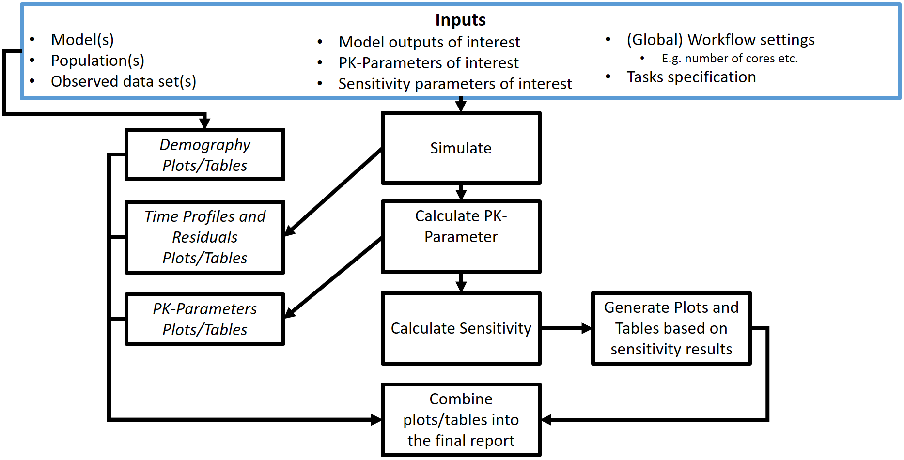

```{r, include = FALSE}
knitr::opts_chunk$set(
  collapse = TRUE,
  comment = "#>"
)
```

```{r setup}
library(ospsuite.reportingengine)
library(ospsuite)
```

This vignette introduces the notions and instances implemented in the OSP-Suite Reporting Engine package (`ospsuite.reportingengine`).

# Introduction

The `ospsuite.reportingengine` package aims at facilitating the design and build of reports evaluating PBPK models developed on PK-Sim.
To this end, `Workflow` instances have been developed.
`Workflow` instances are R objects that can run evaluation tasks for which they will save the output results in an organized structure and in a report.

## Nomenclature

```{r, echo=FALSE, results='asis'}
nomenclatureTable <- data.frame("Name of R object" = c("MeanModelWorkflow",
                                                       "PopulationWorkflow",
                                                       "SimulationSet",
                                                       "PopulationSimulationSet",
                                                       "Task",
                                                       "SimulationTask",
                                                       "PlotTask"),
                                "Object class tree" = c(paste0(c("R6", "Workflow","MeanModelWorkflow"), collapse =" > "),
                                                        paste0(c("R6", "Workflow","PopulationWorkflow"), collapse=" > "),
                                                        paste0(c("R6", "SimulationSet"), collapse=" > "),
                                                        paste0(c("R6", "SimulationSet", "PopulationSimulationSet"), collapse=" > "),
                                                        paste0(c("R6", "Task"), collapse=" > "),
                                                        paste0(c("R6", "Task", "SimulationTask"), collapse=" > "),
                                                        paste0(c("R6", "Task", "PlotTask"), collapse=" > ")),
                                "Definition" = c("Object that runs tasks on simulation sets dedicated to mean models",
                                                 "Object that runs tasks on simulation sets dedicated to population models",
                                                 "Object with information on the simulation and observation to be evaluated",
                                                 "Object with information on the simulation, population and observation to be evaluated",
                                                 "Object with evaluation, plot, table or report to be performed",
                                                 "Object with evaluation to be performed and saved",
                                                 "Object with plot or table to be performed and saved"),
                                check.names = FALSE)
knitr::kable(nomenclatureTable)
```

# `Workflow`

The `Workflow` objects manage 2 other R objects: `Task`s and `SimulationSet`s.

`Task`s are R objects that correspond to the evaluations, plots and tables to be performed, saved and/or reported.
Each active `Task` will be performed on a series of `SimulationSet`s.

A `SimulationSet` is an R object that includes the model to be evaluated as the name of the PK-Sim file (.pkml).
A `SimulationSet` can optionally include observed data and a population file in the case of tin which the PK-Sim model

In `ospsuite.reportingengine`, two types of `Workflow` can be implemented:

1) `MeanModelWorkflow` dedicated on mean models
2) `PopulationWorkflow` dedicated on population models

These `Workflow` objects differ mainly by what their tasks will perform and by the presence of a population file.

## `MeanModelWorkflow`

The process included in `MeanModelWorkflow` can be illustrated by Figure 1.

The blue frame corresponds to the inputs of the workflow. 
These inputs needs to be defined through the R object `SimulationSet`.
Since multiple simulations and observed datasets can be evaluated by the workflow tasks, it is possible to define a list of such inputs by workflow.

The black frames correspond to the tasks of the workflow. 
These tasks are defined through the R object `Task`.
These objects do not have to be instanciated by the user are they are created directly by the `Worklfow` object.
The user will only have to switch them on/off and update their settings if necessary.

```{r, out.width="100%", include=TRUE, fig.align="center", fig.cap= "Figure 1: Mean model workflow inputs and tasks", echo=FALSE}
    knitr::include_graphics("../data/mean-model-workflow-input-and-tasks.png")
```

## `PopulationWorkflow`

The process included in `PopulationWorkflow` can be illustrated by Figure 2.

The blue frame corresponds to the inputs of the workflow. 
These inputs needs to be defined through the R object `PopulationSimulationSet`.
Since multiple simulations, population and observed datasets can be evaluated by the workflow tasks, it is possible to define a list of such inputs by workflow.

The black frames correspond to the tasks of the workflow. 
These tasks are defined through the R object `Task`.
These objects do not have to be instanciated by the user are they are created directly by the `Worklfow` object.
The user will only have to switch them on/off and update their settings if necessary.

```{r, out.width="100%", include=TRUE, fig.align="center", fig.cap= "Figure 2: Population workflow inputs and tasks", echo=FALSE}
    
```

## `Workflow` initialization

To initialize a `MeanModelWorkflow` or a `PopulationWorkflow` object, the method `$new()` needs to be used as follow:

- For mean model workflows: 
```
myWorkflow <- MeanModelWorkflow$new(simulationSets, workflowFolder)
```
- For population workflows: 
```
myWorkflow <- PopulationWorkflow$new(simulationSets, workflowFolder)
```

where `simulationSets` is a list of `SimulationSet` objects for mean models, and a list of `PopulationSimulationSet` objects for population models.
These objects will be further discussed in the next section.

`workflowFolder` is a the name of the folder in which the results of the workflow evaluations will be saved.
When initializing the workflow instance, the existence of the directory named `workflowFolder` will be checked.
If the directory does not exist, `Workflow` will create such a directory for saving all its evaluation.
If the directory does exist, `Workflow` will send a warning message to the user, since it may use and overwrite any existing files within the directory.
This latter option can be useful for updating and running only a parts of the workflow without having to perform all the simulations every time.

# Simulation sets
As workflows can evaluate multiple simulations, populations and datasets, a `MeanModelWorkflow` and `PopulationWorkflow` initializations requires a list of variables of class `SimulationSet` and `PopulationSimulationSet`, respectively.

`SimulationSet` is a class that encapsulates the information necessary to perform the workflow tasks.
`SimulationSet` variable is initialized using the method: 
```{r, eval=FALSE, echo=TRUE}
SimulationSet$new(simulationSetName = NULL,
                              simulationFile,
                              simulationName = NULL,
                              pathID = NULL,
                              pathName = NULL,
                              pathUnit = NULL,
                              pkParameters = enum(ospsuite::allPKParameterNames()),
                              pkParametersNames = NULL,
                              pkParametersUnits = NULL,
                              observedDataFile = NULL,
                              observedMetaDataFile = NULL,
                              dataFilter = NULL,
                              dataReportName = NULL,
                              timeUnit = "h")
```

## Simulation file and name

This method only require the path of the simulation file `simulationFile` (e.g. *mySimulation.pkml*).
`simulationName` and `simulationSetName` are  display names that will be used in the naming of output evaluations and sections of the report.

## Path

`pathID` corresponds to the path name within the simulation (e.g. *Organism|PeripheralVenousBlood|Raltegravir|Plasma (Peripheral Venous Blood)*) and which will be evaluted in the goodness of fit and pk analyses tasks.
`pathName`, `pathUnit` and `timeUnit` are the display names and units that will be used in the naming of output evaluations and sections of the report. 

## PK paramaters

`pkParameters` are the names of the PK parameters to be analyzed (e.g. *C_max*).
`pkParametersNames` and `pkParametersUnits` are the display names and units that will be used in the naming of output evaluations and sections of the report. 

This input definition for PK parameters will soon be replaced by the instances of PK-Parameters directly.

## Data

Data and their dictionary are expected to be saved in csv or txt files.
Consequently, if data are available the input `observedDataFile` and `observedMetaDataFile` are required.
`observedDataFile` is the path of the data file. The data file is expected to be following a Nonmem format (e.g. *myDataset.csv* or *myDataset.txt*).
`observedMetaDataFile` is the path of the metaData file or dictionary which contains information on the data as well as the mapping of the data variables (which column is *ID*, *Time*, *DV*).
`dataReportName` is the  display name that will be used in the naming of output evaluations and sections of the report.

Usually, the all the data is included into one file which needs to be filtered.
The variable `dataFilter` can be either characters or an expression that will be evaluated within the context of the data.
For instance, if the data contains a column named *Grouping* to which only group *A* should be used for the evaluation, the input `dataFilter = 'Grouping %in% "A"'` or `dataFilter = parse(text = 'Grouping %in% "A")'` will be evaluated.

## Population file and name

In the case of a population workflow, the child class `PopulationSimulationSet` should be prefered to `SimulationSet`.
It requires the input of a population file on which the simulation will be performed (e.g. *myPopulation.csv*).
`populationName` is the display name that will be used in the naming of output evaluations and sections of the report.
If no `simulationSetName` is input, `populationName`-`simulationName` will be used for naming the output.

```{r, eval=FALSE, echo=TRUE}
PopulationSimulationSet$new(...,
                            populationFile,
                            populationName = NULL)
```

# `Task` objects

As illustrated in Figures 1 and 2, workflows can perform tasks on a list of simulation sets.
Some of these tasks are not necessarily run or can use the output results from other tasks run in previous workflows.

Any `Workflow` defines a list of `Task` objects when initialized.
Each `Task` is using a similar and common structure: `outputFolder`, `active`, `message` and `settings`.
The `Task` method `print()` shows this structure features.

The workflow methods `getAllTasks()`, `getActiveTasks()` and `getInactiveTasks()` provide the list of all available, active and inactive tasks of the workflow, respectively.

The tasks can be activated/inactivated using the workflow methods `activateTasks(tasks = self$getAllTasks())` and `inactivateTasks(tasks = self$getAllTasks())`.

`Workflow` has also a `print()` method which calls the `print()` methods from each of its tasks.

The following example shows how tasks are implemented as R objects of a `MeanModelWorkflow` implemented in the variable *myWorkflow*.

```{r, include = FALSE}
simSets <- list(SimulationSet$new(simulationFile = "test.pkml",simulationSetName = "testSimulationSet"))
myWorkflow <- MeanModelWorkflow$new(simulationSets = simSets,
                                    workflowFolder = "myFolder")
```

The following chunk prints the name of all the available tasks in *myWorkflow*, and only then only the active tasks.
```{r}
myWorkflow$getAllTasks()
myWorkflow$getActiveTasks()
```

Only the task named `simulate` is active. The method `$print()` shows more details about the task features.
```{r}
myWorkflow$simulate$print()
```

It means that if *myWorkflow* is run, only the simulation of the model will be performed.
Besides, the output results of the workflow task will be saved in the subfolder `r myWorkflow$simulate$outputFolder` within the workflow folder defined by `workflowFolder`.

The following chunk add a new task for goodness of fit to *myWorkflow*.
```{r}
myWorkflow$plotGoF$print()
myWorkflow$activateTasks(tasks = "plotGoF")
myWorkflow$getActiveTasks()
```

```{r, echo=FALSE}
unlink("myFolder", recursive = TRUE)
```

# Outputs

Once the workflow and its settings have been defined, the workflow method `runWorkflow()` will run all the active tasks and generate all the associated results and report.
The output results will follow the structure defined in Figure 3:

```{r, out.width="100%", include=TRUE, fig.align="center", fig.cap= "Figure3: Mean model workflow output structure", echo=FALSE}
    knitr::include_graphics("../data/mean-model-workflow-structure.png")
```

From the figure, it can be noticed that log files are created during the process:

- `log-info.txt`: save relevant messages from the workflow
- `log-error.txt`: save warnings and errors messages
- `log-debug.txt`: save most of messages which can be accessed for debugging purpose.

