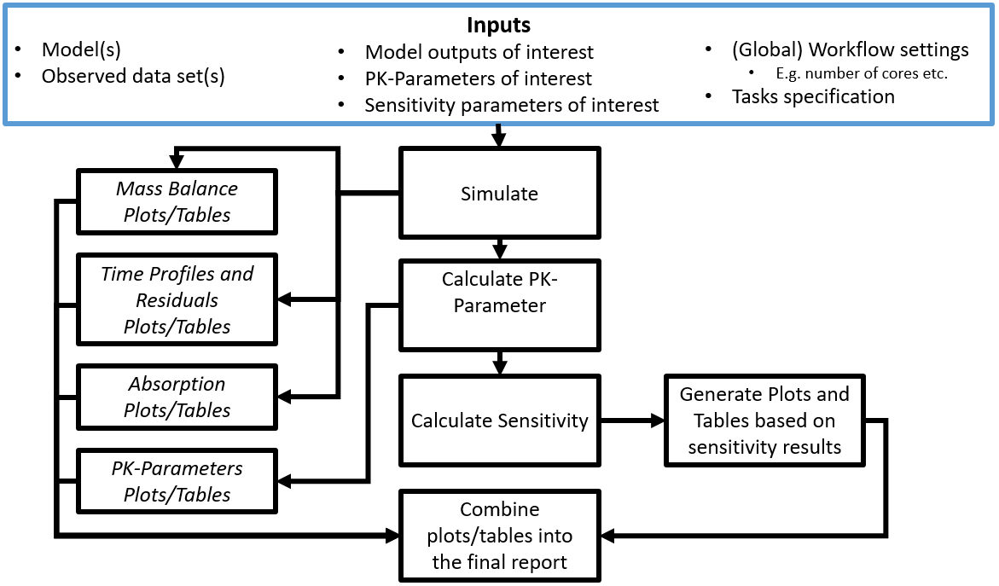
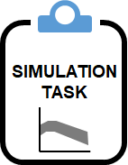
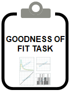

```{r, include = FALSE}
knitr::opts_chunk$set(
  collapse = TRUE,
  comment = "#>"
)
```

```{r setup}
library(ospsuite.reportingengine)
library(ospsuite)
```

This vignette focuses on mean model workflows instanciated by the class `MeanModelWorkflow`.
The general scheme of such workflows is illustrated on Figure 1.

```{r, out.width="100%", include=TRUE, fig.align="center", fig.cap= "Figure 1: Mean model workflow inputs and tasks", echo=FALSE}
    
```

Each section will detail the features of the workflow tasks throughout the example available in tests/dev/01_MeanModel_Raltegravir and defined as *exampleFolder*.
```{r, include = FALSE}
exampleFolder <- "../tests/dev/01_MeanModel_Raltegravir"
```

In this example, the simulation file *simulationFile*, the observed data file *dataFile* and its associated dictionary *dictionary* are defined below defined:
```{r}
simFile <- file.path(exampleFolder, 
                     "PKML/Raltegravir 10 mg   (lactose formulation).pkml")
dataFile <- file.path(exampleFolder, 
                      "Raltegravir_PK.csv")
dictionary <- file.path(exampleFolder, 
                        "tpDictionary.csv")
```


# Simulation of model time profiles



The simulation of time profiles is a task that loads a simulation object from a PK-Sim simulation file using the package `ospsuite`.
Then, the task simulates the time profiles as requested by the simulation set information *pathID*.

For instance, the simulation set *simSetPlasma* below will request from the simulation defined in *simulationFile* only the path *Organism|PeripheralVenousBlood|Raltegravir|Plasma (Peripheral Venous Blood)*;
while the simulation set *simSetBlood* will request Plasma, Plasma Unbound, Blood Cells and Whole Blood.

```{r}
simSetPlasma <- SimulationSet$new(simulationSetName = "Plasma",
                                  simulationFile = simFile,
                                  pathID = "Organism|PeripheralVenousBlood|Raltegravir|Plasma (Peripheral Venous Blood)")
simSetBlood <- SimulationSet$new(simulationSetName = "Blood",
                                 simulationFile = simFile,
                                  pathID = c("Organism|PeripheralVenousBlood|Raltegravir|Plasma (Peripheral Venous Blood)",
                                             "Organism|PeripheralVenousBlood|Raltegravir|Plasma Unbound (Peripheral Venous Blood)",
                                             "Organism|PeripheralVenousBlood|Raltegravir|Blood Cells",
                                             "Organism|PeripheralVenousBlood|Raltegravir|Whole Blood (Peripheral Venous Blood)"))
```

For the example, both sets are defined in the same workflow:

```{r}
simTestWorkflow <- MeanModelWorkflow$new(simulationSets = list(simSetPlasma, 
                                                          simSetBlood),
                                    workflowFolder = "mySimulationTest")
```

The simulation task is the only task that is activated by default, as we can check below:
```{r}
simTestWorkflow$getActiveTasks()
```

The run of the workflow will perform the task *simulate* and save the results in the folder mySimulationTest/SimulationResults as detailed below:
```{r}
simTestWorkflow$simulate$print()
```

```{r}
simTestWorkflow$runWorkflow()
```

```{r}
simulationResultsPath <- file.path(simTestWorkflow$workflowFolder, 
                                   simTestWorkflow$simulate$outputFolder)
simulationResultFiles <- list.files(simulationResultsPath)
```

It can be noticed that the results are saved using the simulation set name *simulationSetName* with the -SimulationResults.csv extension.
The results from *simSetPlasma* simulation set contains only Time and Plasma; while the results from *simSetBlood* simulation set contains Time, Plasma, Unbound Plasma, CellsBlood and Whole Blood.

```{r, results='asis', echo=FALSE}
simTable1 <- read.csv(file.path(simulationResultsPath, 
                                simulationResultFiles[1]), 
                      check.names = FALSE, 
                      encoding = "UTF-8")
knitr::kable(head(simTable1), caption = simulationResultFiles[1])
```

```{r, results='asis', echo=FALSE}
simTable2 <- read.csv(file.path(simulationResultsPath, 
                                simulationResultFiles[2]), 
                      check.names = FALSE, 
                      encoding = "UTF-8")
knitr::kable(head(simTable2), caption = simulationResultFiles[2])
```

```{r, inlcude = FALSE, echo=FALSE}
# Remove the workflow folders
unlink("mySimulationTest", recursive = TRUE)

```

# Plot of time profiles and residuals



# Calculation and plot of the mass balance

# Calculation and plot of the absorption profile

