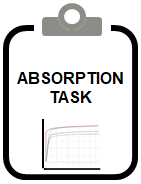

```{r, include = FALSE}
knitr::opts_chunk$set(
  collapse = TRUE,
  comment = "#>"
)
```

```{r setup}
library(ospsuite.reportingengine)
library(ospsuite)
```

This vignette focuses on mean model workflows instanciated by the class `MeanModelWorkflow`.
The general scheme of such workflows is illustrated on Figure 1.

```{r, out.width="100%", include=TRUE, fig.align="center", fig.cap= "Figure 1: Mean model workflow inputs and tasks", echo=FALSE}
    knitr::include_graphics("../data/mean-model-workflow-input-and-tasks.png")
```

Each section will detail the features of the workflow tasks throughout the example available in tests/dev/01_MeanModel_Raltegravir and defined as *exampleFolder*.
```{r, include = FALSE}
exampleFolder <- "../tests/dev/01_MeanModel_Raltegravir"
```

In this example, the simulation file *simulationFile*, the observed data file *dataFile* and its associated dictionary *dictionary* are defined below defined:
```{r}
simFile <- file.path(exampleFolder, 
                     "PKML/Raltegravir 10 mg   (lactose formulation).pkml")
dataFile <- file.path(exampleFolder, 
                      "Raltegravir_PK.csv")
dictionary <- file.path(exampleFolder, 
                        "tpDictionary.csv")
```


# Simulation of model time profiles


The simulation of time profiles is a task that loads a simulation object from a PK-Sim simulation file using the package `ospsuite`.
Then, the task simulates the time profiles as requested by the simulation set information *pathID*.

For instance, the simulation set *simSetPlasma* below will request from the simulation defined in *simulationFile* only the path *Organism|PeripheralVenousBlood|Raltegravir|Plasma (Peripheral Venous Blood)*;
while the simulation set *simSetBlood* will request Plasma, Plasma Unbound, Blood Cells and Whole Blood.

```{r}
simSetPlasma <- SimulationSet$new(simulationSetName = "Plasma",
                                  simulationFile = simFile,
                                  outputs = Output$new(path = "Organism|PeripheralVenousBlood|Raltegravir|Plasma (Peripheral Venous Blood)",displayName = "Plasma",displayUnit = "μg/l"))
simSetBlood <- SimulationSet$new(simulationSetName = "Blood",
                                 simulationFile = simFile,
                                 outputs = c(Output$new(path = "Organism|PeripheralVenousBlood|Raltegravir|Plasma (Peripheral Venous Blood)",
                                                        displayName = "Plasma",displayUnit = "μg/l"),
                                             Output$new(path = "Organism|PeripheralVenousBlood|Raltegravir|Plasma Unbound (Peripheral Venous Blood)",
                                                        displayName = "Plasma Unbound",displayUnit = "μg/l"),
                                             Output$new(path = "Organism|PeripheralVenousBlood|Raltegravir|Blood Cells",
                                                        displayName = "Blood Cells",displayUnit = "μg/l"),
                                             Output$new(path = "Organism|PeripheralVenousBlood|Raltegravir|Whole Blood (Peripheral Venous Blood)",
                                                        displayName = "Whole Blood",displayUnit = "μg/l")))
```

For the example, both sets are defined in the same workflow:

```{r}
simTestWorkflow <- MeanModelWorkflow$new(simulationSets = list(simSetPlasma, 
                                                          simSetBlood),
                                    workflowFolder = "mySimulationTest")
```

The simulation task is the only task that is activated by default, as we can check below:
```{r}
simTestWorkflow$getActiveTasks()
```

The run of the workflow will perform the task *simulate* and save the results in the folder mySimulationTest/SimulationResults as detailed below:
```{r}
simTestWorkflow$simulate$print()
```

```{r}
simTestWorkflow$runWorkflow()
```

```{r}
simulationResultsPath <- file.path(simTestWorkflow$workflowFolder, 
                                   simTestWorkflow$simulate$outputFolder)
simulationResultsFiles <- list.files(simulationResultsPath)
simulationResultsFiles
```

It can be noticed that the results are saved using the simulation set name *simulationSetName* with the -SimulationResults.csv extension.
The results from *simSetPlasma* simulation set contains only Time and Plasma; while the results from *simSetBlood* simulation set contains Time, Plasma, Unbound Plasma, CellsBlood and Whole Blood.

```{r, results='asis', echo=FALSE}
simTable1 <- read.csv(file.path(simulationResultsPath, 
                                simulationResultsFiles[1]), 
                      check.names = FALSE, 
                      encoding = "UTF-8")
knitr::kable(head(simTable1), caption = simulationResultsFiles[1])
```

```{r, results='asis', echo=FALSE}
simTable2 <- read.csv(file.path(simulationResultsPath, 
                                simulationResultsFiles[2]), 
                      check.names = FALSE, 
                      encoding = "UTF-8")
knitr::kable(head(simTable2), caption = simulationResultsFiles[2])
```

# Plot of time profiles and residuals


The natural step after simulating time profiles is to plot them.
The goodness of fit plot is a task that loads simulation results that were obtained and saved from the previous task, and then generate plots.
If observed data are provided, the plots generated and saved by the task will correspond to:

- Time profiles
- Time profiles in log-scale
- Observed vs simulated
- Observed vs simulated in log-scale
- Residuals vs time
- Residuals vs simulated
- Histogram across the simulations

If no observed data are provided, only linear and log-scale time profile plots will be plotted.
As for the simulation, the name of the result output will be the name of the simulation set with the extension -timeProfile.png,  -timeProfile.png,  -timeProfileLog.png,  -obsVsPred.png,  -obsVsPredLog.png, -resVsTime.png or -resVsPred.png.

## Example without observed data

The previous example can be re-used for illustrating the output of task when observed data are not provided.
In the example, the SimulationSet fields *pathUnit* and *pathName* were filled, their purposes is to create the names used in the plots and convert the simulation in the target unit.

It can be noted that for this specific example, the workflow was directly updated, but it is also possible to initialize a new workflow and using the same workflow folder to perform this task.

```{r}
simTestWorkflow$plotGoF$print()
simTestWorkflow$activateTasks(tasks = "plotGoF")
simTestWorkflow$inactivateTasks(tasks = "simulate")
simTestWorkflow$getActiveTasks()
```
Re-runnig the workflow will now skip the simulation task as it was inactivated and will directly perform the plot of time profiles.
```{r}
simTestWorkflow$runWorkflow()
```

Now, the results correspond to the png figures of the 4 plots.
```{r}
timeProfileResultsPath <- file.path(simTestWorkflow$workflowFolder, 
                                    simTestWorkflow$plotGoF$outputFolder)
timeProfileResultsFiles <- list.files(timeProfileResultsPath)
timeProfileResultsFiles
```

```{r, include=FALSE, echo=FALSE}
# Get only the plots
timeProfileFigures <- timeProfileResultsFiles[grepl(".png", timeProfileResultsFiles)]
```

```{r, out.width="100%", include=TRUE, fig.align="center", echo=FALSE, fig.cap=timeProfileFigures[1]}
knitr::include_graphics(file.path(timeProfileResultsPath, timeProfileFigures[1]))
```
```{r, out.width="100%", include=TRUE, fig.align="center", echo=FALSE, fig.cap=timeProfileFigures[2]}
knitr::include_graphics(file.path(timeProfileResultsPath, timeProfileFigures[2]))
```
```{r, out.width="100%", include=TRUE, fig.align="center", echo=FALSE, fig.cap=timeProfileFigures[3]}
knitr::include_graphics(file.path(timeProfileResultsPath, timeProfileFigures[3]))
```
```{r, out.width="100%", include=TRUE, fig.align="center", echo=FALSE, fig.cap=timeProfileFigures[4]}
knitr::include_graphics(file.path(timeProfileResultsPath, timeProfileFigures[4]))
```

```{r, inlcude = FALSE, echo=FALSE}
# Remove the workflow folders
#unlink("mySimulationTest", recursive = TRUE)
```

## Inclusion of observed data

Observed data can be included to time profiles, the task will then perform the calculation of residuals between the simulations and observations.
```
Residuals = log(Observations) - log(Simulations)
```

When including observed data, the path of the data file and its dictionary are required.
Optional input can also be added such as the name of the data in the plots and filters to select which data should be plotted and compared to simulations.
```{r}
try(badSimSet <- SimulationSet$new(simulationFile = simFile,
                                   observedDataFile = dataFile))

try(goodSimSet <- SimulationSet$new(simulationFile = simFile,
                                    observedDataFile = dataFile,
                                    observedMetaDataFile = dictionary
                                    ))
```

The observed data are expected to follow a the following Nonmem format:
```{r, echo=FALSE, results='asis'}
knitr::kable(head(readObservedDataFile(dataFile)), caption = "Observed Data")
```

Similarly, the dictionary is a csv file that will map the data with the following nomenclature:
```{r, echo=FALSE, results='asis'}
knitr::kable(readObservedDataFile(dictionary), caption = "Dictionary")
```

The following examples will show how to implement the inclusion and how to perform the selection in one or more observed data.
```{r}
simSetNoFilter <- SimulationSet$new(simulationSetName = "Plasma0",
                                    simulationFile = simFile,
                                    pathID = "Organism|PeripheralVenousBlood|Raltegravir|Plasma (Peripheral Venous Blood)",
                                    pathUnit = "mg/l",
                                    pathName = "Plasma",
                                    observedDataFile = dataFile,
                                    observedMetaDataFile = dictionary
                                  )

simSetOneFilter <- SimulationSet$new(simulationSetName = "Plasma1",
                                     simulationFile = simFile,
                                     pathID = "Organism|PeripheralVenousBlood|Raltegravir|Plasma (Peripheral Venous Blood)",
                                     pathUnit = "mg/l",
                                     pathName = "Plasma",
                                     observedDataFile = dataFile,
                                     observedMetaDataFile = dictionary,
                                     dataFilter = 'Grouping %in% "10mg_"'
                                  )

simSetOneFilterMultipleSim <- SimulationSet$new(simulationSetName = "Plasma2",
                                                simulationFile = simFile,
                                                pathID = c("Organism|PeripheralVenousBlood|Raltegravir|Plasma (Peripheral Venous Blood)",
                                                           "Organism|PeripheralVenousBlood|Raltegravir|Plasma Unbound (Peripheral Venous Blood)"),
                                                pathUnit = c("mg/l", "mg/l"),
                                                pathName = c("Plasma", "Plasma Unbound"),
                                                observedDataFile = dataFile,
                                                observedMetaDataFile = dictionary,
                                                dataFilter = 'Grouping %in% "10mg_"'
                                  )
simSetTwoFiltersTwoSim <- SimulationSet$new(simulationSetName = "Plasma3",
                                            simulationFile = simFile,
                                            pathID = c("Organism|PeripheralVenousBlood|Raltegravir|Plasma (Peripheral Venous Blood)",
                                                "Organism|PeripheralVenousBlood|Raltegravir|Plasma Unbound (Peripheral Venous Blood)"),
                                            pathUnit = c("mg/l", "mg/l"),
                                            pathName = c("Plasma", "Plasma Unbound"),
                                            observedDataFile = dataFile,
                                            observedMetaDataFile = dictionary,
                                            dataFilter = c('Grouping %in% "10mg_" & Time < 5',
                                                           'Grouping %in% "10mg_" & Time >= 5')
                                            )
```

```{r}
obsTestWorkflow <- MeanModelWorkflow$new(simulationSets = list(simSetNoFilter, 
                                                               simSetOneFilter,
                                                               simSetOneFilterMultipleSim,
                                                               simSetTwoFiltersTwoSim),
                                    workflowFolder = "myObservationTest")

obsTestWorkflow$activateTasks(tasks = c("simulate", "plotGoF"))
obsTestWorkflow$getActiveTasks()
```

```{r}
obsTestWorkflow$runWorkflow()
```

Now, the TimeProfile folder includes more figures:
```{r}
timeProfileResultsPath <- file.path(obsTestWorkflow$workflowFolder, 
                                    obsTestWorkflow$plotGoF$outputFolder)
timeProfileResultsFiles <- list.files(timeProfileResultsPath)
timeProfileResultsFiles
```

```{r, include=FALSE, echo=FALSE}
# Get only the plots
timeProfileFigures <- timeProfileResultsFiles[grepl(".png", timeProfileResultsFiles)]
```

The first series of plots (`r paste0(timeProfileFigures[1:6])`) corresponds to all observed data vs the simulation in plasma corresponding to only one dose of 10 mg.
As expected, since data were not filtered, all of the data contained in the observed data file was plotted even if most of them are not related to the simulation.

```{r, out.width="100%", include=TRUE, fig.align="center", echo=FALSE}
knitr::include_graphics(file.path(timeProfileResultsPath, timeProfileFigures[1:6]))
```
<p align="center">No filter applied</p>

The second series of plots (`r paste0(timeProfileFigures[7:12])`) corresponds to observed data selected using the filter `Grouping %in% "10mg_"`.
This filter was translated by the workflow as select all the data in the `Grouping` column that matched "10mg_".
Since the data were correctly filtered based on the dose administered, they match better with the simulation.

```{r, out.width="100%", include=TRUE, fig.align="center", echo=FALSE}
knitr::include_graphics(file.path(timeProfileResultsPath, timeProfileFigures[7:12]))
```
<p align="center">Filter applied: `'Grouping %in% "10mg_"'`</p>

The third series of plots (`r paste0(timeProfileFigures[13:18])`) corresponds to observed data selected using the filter `Grouping %in% "10mg_"` and simulated data for 2 paths corresponding to Plasma and Plasma Unbound.
Since 2 paths were requested, they are plotted in the time profile.
However, only the paths input in same positions as the data filter positions are used for the calculation of residuals.
As a consequence, the time profile include one more simulation than the previous series while the other plots remain the same.

```{r, out.width="100%", include=TRUE, fig.align="center", echo=FALSE}
knitr::include_graphics(file.path(timeProfileResultsPath, timeProfileFigures[13:18]))
```
<p align="center">Two simulation paths (Plasma and Plasma Unbound) but one filter applied (`'Grouping %in% "10mg_"'`)</p>

The fourth series of plots (`r paste0(timeProfileFigures[19:24])`) used two filters corresponding to time points before and after 5h.
Since two filters are applied they will appear separately in the time profile.
Regarding the residuals the first filter is matched to the first simulation path (Plasma), while the second is matched to the second simulation path (Plasma Unbound)
```{r, out.width="100%", include=TRUE, fig.align="center", echo=FALSE}
knitr::include_graphics(file.path(timeProfileResultsPath, timeProfileFigures[19:24]))
```
<p align="center">Two simulation paths and two filters applied</p>

The last plot extract the residuals for every simulation set and plot their historgram.
```{r, out.width="100%", include=TRUE, fig.align="center", echo=FALSE, fig.cap=timeProfileFigures[25]}
knitr::include_graphics(file.path(timeProfileResultsPath, timeProfileFigures[25]))
```

# Calculation and plot of the mass balance


The mass balance plot is a task that loads a simulation object from a PK-Sim simulation file using the package `ospsuite`.
Then, the task simulates and plot all the relevant amounts of the simulation over time to check for mass balance.

As a consequence, this task only requires the *simulationFile* field from the simulation set.

```{r}
massbalanceSimSet <- SimulationSet$new(simulationFile = simFile)
```

```{r}
massbalanceWorkflow <- MeanModelWorkflow$new(simulationSets = list(massbalanceSimSet),
                                             workflowFolder = "myMassBalanceTest")

massbalanceWorkflow$plotMassBalance$print()

massbalanceWorkflow$inactivateTasks(tasks = "simulate")
massbalanceWorkflow$activateTasks(tasks = "plotMassBalance")
massbalanceWorkflow$getActiveTasks()
```

```{r}
massbalanceWorkflow$runWorkflow()
```
As shown by the task print method, the output of mass balance will be saved in a folder named MassBalance.
Five plots will be performed and saved each time: 

- Time profiles
- Cumulative time profiles
- Time profiles normalized by total amount
- Cumulative time profiles normalized by total amount
- Pie chart of normalized amount at last simulated time point

```{r}
massBalanceResultsPath <- file.path(massbalanceWorkflow$workflowFolder, 
                                    massbalanceWorkflow$plotMassBalance$outputFolder)
massBalanceResultsFiles <- list.files(massBalanceResultsPath)
massBalanceResultsFiles
```

```{r, include = FALSE, echo = FALSE}
# Get only the plots
massBalanceFigures <- massBalanceResultsFiles[grepl(".png", massBalanceResultsFiles)]
```

```{r, out.width="100%", include=TRUE, fig.align="center", echo=FALSE, fig.cap=massBalanceFigures[1]}
knitr::include_graphics(file.path(massBalanceResultsPath, massBalanceFigures[1]))
```
```{r, out.width="100%", include=TRUE, fig.align="center", echo=FALSE, fig.cap=massBalanceFigures[2]}
knitr::include_graphics(file.path(massBalanceResultsPath, massBalanceFigures[2]))
```
```{r, out.width="100%", include=TRUE, fig.align="center", echo=FALSE, fig.cap=massBalanceFigures[3]}
knitr::include_graphics(file.path(massBalanceResultsPath, massBalanceFigures[3]))
```
```{r, out.width="100%", include=TRUE, fig.align="center", echo=FALSE, fig.cap=massBalanceFigures[4]}
knitr::include_graphics(file.path(massBalanceResultsPath, massBalanceFigures[4]))
```
```{r, out.width="100%", include=TRUE, fig.align="center", echo=FALSE, fig.cap=massBalanceFigures[5]}
knitr::include_graphics(file.path(massBalanceResultsPath, massBalanceFigures[5]))
```

```{r, inlcude = FALSE, echo=FALSE}
# Remove the workflow folders, however if folder is removed, the html can't be knitted
#unlink("myMassBalanceTest", recursive = TRUE)
```

# Calculation and plot of the absorption profile



The simulation of absorption time profiles is a task that loads a simulation object from a PK-Sim simulation file using the package `ospsuite`.
Then, the task simulates the time profiles to the absorption of relevant compounds.

As a consequence, this task only requires the *simulationFile* field from the simulation set.

```{r}
absorptionSimSet <- SimulationSet$new(simulationFile = simFile)
```

```{r}
absorptionWorkflow <- MeanModelWorkflow$new(simulationSets = list(absorptionSimSet),
                                            workflowFolder = "myAbsorptionTest")

absorptionWorkflow$plotAbsorption$print()

absorptionWorkflow$inactivateTasks(tasks = "simulate")
absorptionWorkflow$activateTasks(tasks = "plotAbsorption")
absorptionWorkflow$getActiveTasks()
```

```{r}
absorptionWorkflow$runWorkflow()
```
As shown by the task print method, the output of absorption will be saved in a folder named Absorption.
One plot per releveant compound will be performed and saved each time.

```{r}
absorptionResultsPath <- file.path(absorptionWorkflow$workflowFolder, 
                                    absorptionWorkflow$plotAbsorption$outputFolder)
absorptionResultsFiles <- list.files(absorptionResultsPath)
absorptionResultsFiles
```

```{r, include = FALSE, echo = FALSE}
# Get only the plots
absorptionFigures <- absorptionResultsFiles[grepl(".png", absorptionResultsFiles)]
```

```{r, out.width="100%", include=TRUE, fig.align="center", echo=FALSE, fig.cap=absorptionFigures[1]}
knitr::include_graphics(file.path(absorptionResultsPath, absorptionFigures[1]))
```

```{r, inlcude = FALSE, echo=FALSE}
# Remove the workflow folders
#unlink("myAbsorptionTest", recursive = TRUE)
```

# Reporting

Running workflow tasks is associated with writing of markdown chunks within the file *Report.md* located in the workflow folder.
The final document correspond to the report with sections associated to the tasks and subsections associated to the simulation sets.

Since markdown format can be easily converted in other format such as html, pdf or docx, it was prefered for such document.
Conversion can directly be performed in R, using knitr::pandoc with options suited to the reported format.

As tasks may be re-run on some part of the workflow, the report appends the new sections to the current report.
However, the user can clear the content of the report by activating the task `resetReport`.

The package `ospsuite.reportingengine` also provides function that can be used to manually add text (`addTextChunk`), figures (`addFigureChunk`) and tables (`addTableChunk`) to the markdown document.

