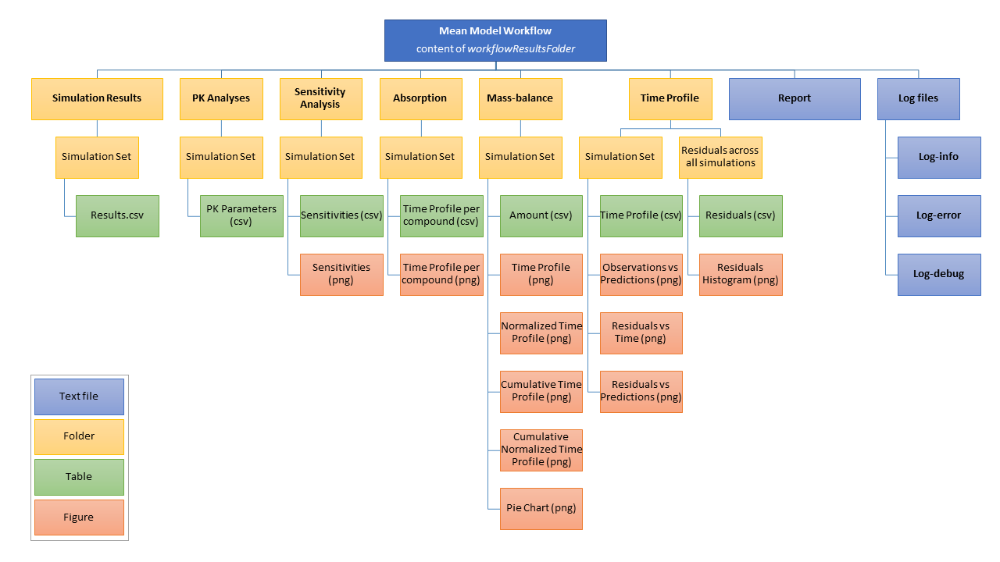

```{r, include = FALSE}
knitr::opts_chunk$set(
  collapse = TRUE,
  comment = "#>"
)
```

```{r setup}
library(ospsuite.reportingengine)
library(ospsuite)
```

# Introduction

The R package for the OSP Suite Reporting Engine (`ospsuite.reportingengine`) aims at facilitating the design and build of reports evaluating PBPK models developed on PK-Sim.
To this end, `Workflow` instances have been developed. They generate an organized structure in which they run `Tasks` that evaluate simulations and report corresponding tables and plots.

This section focuses on mean model workflows instanciated by the class `MeanModelWorkflow`.
The general scheme of such workflows is illustrated on Figure 1.

```{r, out.width="100%", include=TRUE, fig.align="center", fig.cap= "Figure 1: Mean model workflow inputs and tasks", echo=FALSE}
    knitr::include_graphics("../data/mean-model-workflow-input-and-tasks.png")
```

# Inputs

`MeanModelWorkflow` variable is initialized using the method `MeanModelWorkflow$new(simulationSets, workflowFolder = NULL)`.

## simulationSets
As mean model workflows evaluate one or more simulations - if available with data, `MeanModelWorkflow$new(simulationSets, workflowFolder = NULL)` requires a list of variables of class `SimulationSet`.

`SimulationSet` is a class that encapsulates the information necessary to perform the workflow tasks.
`SimulationSet` variable is initialized using the method: 
```{r, eval=FALSE, echo=TRUE}
SimulationSet$new(simulationSetName = NULL,
                              simulationFile,
                              simulationName = NULL,
                              pathID = NULL,
                              pathName = NULL,
                              pathUnit = NULL,
                              pkParameters = enum(ospsuite::allPKParameterNames()),
                              pkParametersNames = NULL,
                              pkParametersUnits = NULL,
                              observedDataFile = NULL,
                              observedMetaDataFile = NULL,
                              dataFilter = NULL,
                              dataReportName = NULL,
                              timeUnit = "h")
```

### Simulation file and name

This method only require the path of the simulation file `simulationFile` (e.g. *mySimulation.pkml*).
`simulationName` and `simulationSetName` are  display names that will be used in the naming of output evaluations and sections of the report.

### Path

`pathID` corresponds to the path name within the simulation (e.g. *Organism|PeripheralVenousBlood|Raltegravir|Plasma (Peripheral Venous Blood)*) and which will be evaluted in the goodness of fit and pk analyses tasks.
`pathName`, `pathUnit` and `timeUnit` are the display names and units that will be used in the naming of output evaluations and sections of the report. 

### PK paramaters

`pkParameters` are the names of the PK parameters to be analyzed (e.g. *C_max*).
`pkParametersNames` and `pkParametersUnits` are the display names and units that will be used in the naming of output evaluations and sections of the report. 

This input definition for PK parameters will soon be replaced by the instances of PK-Parameters directly.

### Data

Data and their dictionary are expected to be saved in csv or txt files.
Consequently, if data are available the input `observedDataFile` and `observedMetaDataFile` are required.
`observedDataFile` is the path of the data file. The data file is expected to be following a Nonmem format (e.g. *myDataset.csv* or *myDataset.txt*).
`observedMetaDataFile` is the path of the metaData file or dictionary which contains information on the data as well as the mapping of the data variables (which column is *ID*, *Time*, *DV*).
`dataReportName` is the  display name that will be used in the naming of output evaluations and sections of the report.

Usually, the all the data is included into one file which needs to be filtered.
The variable `dataFilter` can be either characters or an expression that will be evaluated within the context of the data.
For instance, if the data contains a column named *Grouping* to which only group *A* should be used for the evaluation, the input `dataFilter = 'Grouping %in% "A"'` or `dataFilter = parse(text = 'Grouping %in% "A")'` will be evaluated.

## workflowFolder

`workflowFolder` is a the name of the folder in which the results of the workflow evaluations will be saved.
This input is not required. 

If left `NULL`, `MeanModelWorkflow` will create a new directory using a default nomenclature.
The folder name will be *`Workflow_<Date>_<Time>`*.

If `workflowFolder` is input, `MeanModelWorkflow` will check for the existence of the directory.
If the directory does not exist, `MeanModelWorkflow` will create a new one corresponding to the input.
If the directory does exist, `MeanModelWorkflow` will send a warning message to the user, since it may use and overwrite any existing files within the directory.
This functionality can be useful for updating and running only a parts of the workflow without having to perform all the simulations every time.


# `Task` instances

As illustrated in Figure 1, the workflow is performing a series of tasks.
Since some of the tasks are not always run, it is possible to activate/inactivate those before running the workflow.

As a consequence, the `MeanModelWorkflow` defines a list of `Task` instances when initialized.
Each `Task` is using a similar and common structure: `input`, `output`, `active`, `message` and `settings`.

The workflow methods `MeanModelWorkflow$getAllTasks()`, `MeanModelWorkflow$getActiveTasks()` and `MeanModelWorkflow$getInactiveTasks()` provide the list of all available, active and inactive tasks of the workflow, respectively.

The tasks can be activated/inactivated using the workflow methods `MeanModelWorkflow$activateTasks()` and `MeanModelWorkflow$inactivateTasks()`.


# Outputs

Once the workflow and its settings have been defined, the workflow method `MeanModelWorkflow$runWorkflow()` will perform the tasks and generate the output results and report.
The output results will follow the structure defined in Figure 2:

```{r, out.width="100%", include=TRUE, fig.align="center", fig.cap= "Mean model workflow output structure", echo=FALSE}
    
```

# Example 01: Raltegravir

The example presented in the sequel shows how to implement and run a mean model workflow.
The data and corresponding test scripts for the following example are available in the folder *tests/dev/01_MeanModel_Raltegravir*.
```{r}
testFolder <- "../tests/dev/01_MeanModel_Raltegravir"
```

In this example, 2 simulations are evaluated. 
These simulations are stored within the folder *PKML*.

## Definition of the simulation files and paths to be evaluated

```{r}
simFolder <- file.path(testFolder, "PKML")
simFiles <- file.path(simFolder, list.files(simFolder))
simFiles
```

```{r}
simPath <- 'Organism|PeripheralVenousBlood|Raltegravir|Plasma (Peripheral Venous Blood)'
simPathName <- 'Raltegravir'
simPathUnit <- '�g/l'
```
## Definition of the data files and filters

```{r}
Raltegravir_PKFile <- file.path(testFolder, "Raltegravir_PK.csv")
tpDictionaryFile <- file.path(testFolder, "tpDictionary.csv")
```

The observed data file contains a table starting by:
```{r, echo = FALSE, results = "as.is"}
knitr::kable(head(read.csv(Raltegravir_PKFile)), caption = "Head of observed data")
```

The dictionary contains the following table: 
```{r, echo = FALSE, results = "as.is"}
knitr::kable(read.csv(tpDictionaryFile), caption = "Dictionary")
```

The data filters corresponding to the simulations are defined as follow.
To improve the clarity of the variables, simulation files names were attributed to the characters of `dataFilter`.
```{r}
dataFilters <- paste0('Grouping %in% "', c("10mg_", "50mg"), '"')
names(dataFilters) <- simFiles

dataFilters
```

## Definition of simulation sets instances

The following code chunk creates list of mean model sets for the mean model workflow.
To improve the clarity of the variables, simulation files names were attributed to the elements of the simulation sets list.

```{r}
meanModelSets <- list()

for (simFile in simFiles){
  modelSet <-  SimulationSet$new(simulationFile = simFile,
                                 pathID = simPath,
                                 pathName = simPathName,
                                 pathUnit = simPathUnit,
                                 dataFilter = dataFilters[simFile],
                                 observedDataFile = Raltegravir_PKFile,
                                 observedMetaDataFile = tpDictionaryFile)
  
  meanModelSets[[modelSet$simulationSetName]] <- modelSet
}

meanModelSets
```

## Definition of the mean model workflow

Initialize workflow structure with `meanModelSets` as the list of simulation sets.
and `"WorkflowTest01"` as workflow folder.

```{r}
meanWorkflow <- MeanModelWorkflow$new(simulationSets = meanModelSets)
#workflowFolder = file.path(testFolder, "WorkflowTest01"))
```

## Workflow tasks

Check the list of tasks, which ones are active/inactive
```{r}
meanWorkflow$getAllTasks()
meanWorkflow$getActiveTasks()
meanWorkflow$getInactiveTasks()
```

Set the tasks to perform, which ones are active/inactive
```{r}
meanWorkflow$activateTasks(tasks = c("plotGoF", "plotAbsorption", "plotMassBalance"))
meanWorkflow$inactivateTasks(tasks = c("meanModelPKParameters", "plotPKParameters"))
meanWorkflow$getActiveTasks()
meanWorkflow$getInactiveTasks()
```

## Workflow tasks

Run the workflow.
All the information of the run are also available within log files.
```{r, eval=FALSE}
#meanWorkflow$runWorkflow()
```

```{r, echo=FALSE, eval=FALSE}
#report <- readLines(file.path(meanWorkflow$workflowFolder, "Report.html"))
#knitr::raw_html(report)
```