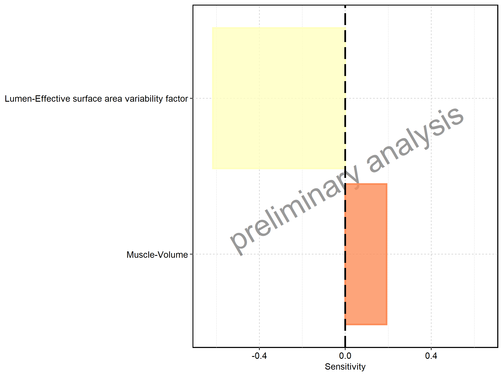
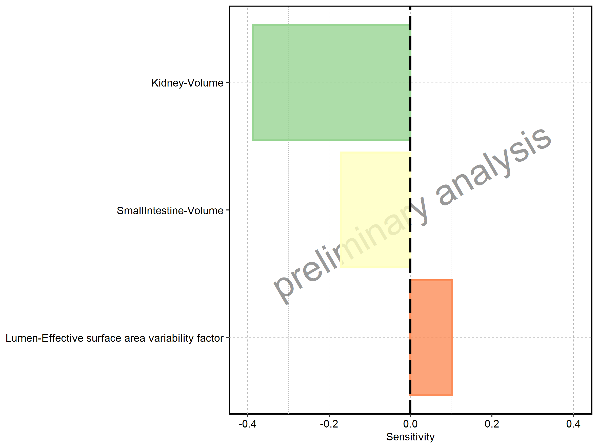
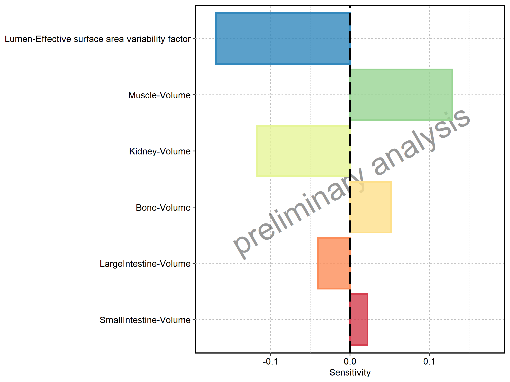

 * [1. Sensitivity Analysis](#1-sensitivity-analysis)
   * [1.1. Sensitivity Analysis for ral](#11-sensitivity-analysis-for-ral)

# 1. Sensitivity Analysis

## 1.1. Sensitivity Analysis for ral

Figure 1: Most sensitive parameters for new_t_max of op2.

Figure 2: Most sensitive parameters for new_AUC_tEnd of op2.

Figure 3: Most sensitive parameters for new_C_max of op3.

Figure 4: Most sensitive parameters for new_MRT of op3.

