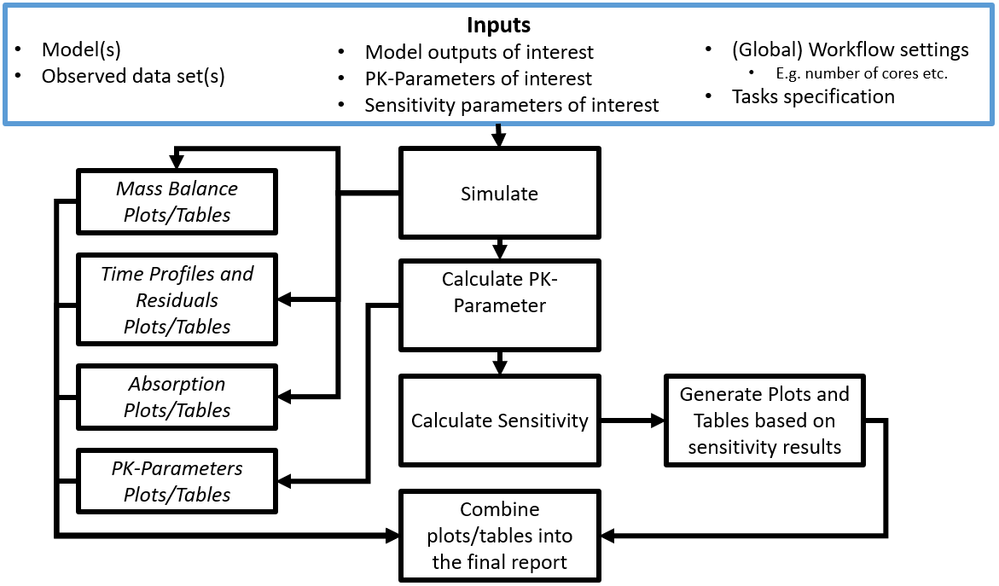

```{r vignette setup, include = FALSE}
knitr::opts_chunk$set(
  collapse = TRUE,
  comment = "#>"
)
source(system.file("extdata", "vignette-helpers.R", package = "ospsuite.reportingengine"))
```

```{r setup}
require(ospsuite.reportingengine)
```

This vignette introduces the notions and objects implemented in the OSP-Suite Reporting Engine package (`ospsuite.reportingengine`).

# 1. Introduction
## 1.1. Notion of R6 objects

The `ospsuite.reportingengine` package aims at facilitating the design and build of reports evaluating PBPK models developed on PK-Sim or/and MoBi.

To this end, the package benefits from the concept of R6 classes (similar to reference classes) which allows to define structured objects whose fields can be any object such as properties, methods or even other R6 objects.
R6 objects, or objects from R6 class, presents some peculiarities.

- They are usually initialized using the method `$new(...)` (e.g. `r6Object <- R6Class$new()`).
- Similarly to objects of class list, fields from R6 objects can be called using either `$fieldName` or `[[fieldName]]` (e.g. `r6Object$method()` or `r6Object[[property]]`).
- The R6 class also integrates the concept of inheritance: an R6 object will get the attributes from its class but will also inherit properties and methods from a parent class.

## 1.2. Notion of workflow

The `ospsuite.reportingengine` package is built around 3 central R6 classes __`MeanModelWorkflow`__,  __`PopulationWorkflow`__ and __`QualificationWorkflow`__ derived from the parent R6 class `Workflow`.
The creation of `MeanModelWorkflow` or `PopulationWorkflow` objects provides a structured environment with methods and properties that facilitate the design, run and report of the evaluations of PBPK models developed on PK-Sim or/and MoBi.
For `QualificationWorkflow` objects, more details are available in a dedicated [article](https://www.open-systems-pharmacology.org/OSPSuite.ReportingEngine/articles/qualification-workflow.html).
The `Worklow` objects combine 2 features defined as R6 objects:

- `SimulationSet` and `PopulationSimulationSet` objects defines which and how model(s) and/or data can be used by the workflow (developed in more details in section [3](#3-simulation-sets)).
These objects need to be created before the creation of workflow objects as they are required to create the workflow.
- `Task` objects define the evaluations to be performed by the workflow. These objects are directly created and included upon creation of the `Workflow` objects (developed in more details in section [4](#4-tasks)). Their settings can be checked and updated after creation.

## 1.3. Nomenclature

Table 1 enumerates some of the main instances of the `ospsuite.reportingengine` package usually defined by users during the design of a workflow.
The tab [Reference](https://www.open-systems-pharmacology.org/OSPSuite.ReportingEngine/reference) documents available classes and functions exported by the `ospsuite.reportingengine` package.
The comprehensive documentation and usage of each of these objects is accessible in the tab **Reference**.

**Table 1: Nomenclature of `ospsuite.reportingengine` main instances**

|**Workflow objects**|**Use case**|
|--------------------|------------|
|[MeanModelWorkflow](https://www.open-systems-pharmacology.org/OSPSuite.ReportingEngine/reference/MeanModelWorkflow.html)|Defined by user|
|[PopulationWorkflow](https://www.open-systems-pharmacology.org/OSPSuite.ReportingEngine/reference/PopulationWorkflow.html)|Defined by user|
|[QualificationWorkflow](https://www.open-systems-pharmacology.org/OSPSuite.ReportingEngine/reference/loadQualificationWorkflow.html)|Build in [loadQualificationWorkflow](https://www.open-systems-pharmacology.org/OSPSuite.ReportingEngine/reference/QualificationWorkflow.html)|
|**Simulation Set objects**|**Use case**|
|[SimulationSet](https://www.open-systems-pharmacology.org/OSPSuite.ReportingEngine/reference/SimulationSet.html)|Defined by user|
|[PopulationSimulationSet](https://www.open-systems-pharmacology.org/OSPSuite.ReportingEngine/reference/PopulationSimulationSet.html)|Defined by user|
|[ConfigurationPlan](https://www.open-systems-pharmacology.org/OSPSuite.ReportingEngine/reference/ConfigurationPlan.html)|Build in [loadQualificationWorkflow](https://www.open-systems-pharmacology.org/OSPSuite.ReportingEngine/reference/QualificationWorkflow.html)|
|**Output path and PK parameter objects**|**Use case**|
|[Output](https://www.open-systems-pharmacology.org/OSPSuite.ReportingEngine/reference/Output.html)|Defined by user|
|[PkParameterInfo](https://www.open-systems-pharmacology.org/OSPSuite.ReportingEngine/reference/PkParameterInfo.html)|Defined by user|
|**Workflow task objects**|**Use case**|
|[Task](https://www.open-systems-pharmacology.org/OSPSuite.ReportingEngine/reference/Task.html)|Build in workflow objects|
|[SimulationTask](https://www.open-systems-pharmacology.org/OSPSuite.ReportingEngine/reference/SimulationTask.html)|Build in workflow objects|
|[SensitivityAnalysisTask](https://www.open-systems-pharmacology.org/OSPSuite.ReportingEngine/reference/SensitivityAnalysisTask.html)|Build in workflow objects|
|[PopulationSensitivityAnalysisTask](https://www.open-systems-pharmacology.org/OSPSuite.ReportingEngine/reference/PopulationSensitivityAnalysisTask.html)|Build in workflow objects|
|[QualificationTask](https://www.open-systems-pharmacology.org/OSPSuite.ReportingEngine/reference/QualificationTask.html)|Build in [QualificationWorkflow](https://www.open-systems-pharmacology.org/OSPSuite.ReportingEngine/reference/loadQualificationWorkflow.html) objects|
|[PlotTask](https://www.open-systems-pharmacology.org/OSPSuite.ReportingEngine/reference/PlotTask.html)|Build in workflow objects|
|[PopulationPlotTask](https://www.open-systems-pharmacology.org/OSPSuite.ReportingEngine/reference/PopulationPlotTask.html)|Build in [PopulationWorkflow](https://www.open-systems-pharmacology.org/OSPSuite.ReportingEngine/reference/PopulationWorkflow.html) objects|
|[GofPlotTask](https://www.open-systems-pharmacology.org/OSPSuite.ReportingEngine/reference/GofPlotTask.html)|Build in workflow objects|
|**Workflow task settings objects**|**Use case**|
|PlotSettings|Build in workflow objects|
|[SensitivityPlotSettings](https://www.open-systems-pharmacology.org/OSPSuite.ReportingEngine/reference/SensitivityPlotSettings.html)|Build in workflow objects|


## 1.4. General scheme

In order to define and run appropriately a Workflow object, a few steps are required:

- 1. Load the `ospsuite.reportingengine` package
```r
library(ospsuite.reportingengine)
```
- 2. Define the simulation outputs possibly with their PK parameters
```r
Output$new()
```
- 3. Define the simulation sets possibly mapping simulations to observed data
```r
SimulationSet$new()
```
- 4. Define the workflow and its result folder
```r
Workflow$new()
```
- 5. Define the workflow tasks
```r
workflow$activateTasks()
```
- 6. Run the workflow
```r
workflow$runWorkflow()
```

A working example of workflow script is provided below for reporting a time profile plot on *Minimodel2.pkml*.

<details>
<summary> __Code__ </summary>

```{r general scheme, warning=FALSE, results='hide',message=FALSE}
# Get the pkml simulation file: "MiniModel2.pkml"
simulationFile <- system.file("extdata", "MiniModel2.pkml",
  package = "ospsuite.reportingengine"
)

# Create Output objects which define output paths that will be plotted by the workflow
outputA <- Output$new(
  path = "Organism|A|Concentration in container",
  displayName = "Concentration of A"
)
outputB <- Output$new(
  path = "Organism|B|Concentration in container",
  displayName = "Concentration of B"
)

# Create a SimulationSet object which defines the model and outputs to evaluate
myExampleSet <- SimulationSet$new(
  simulationSetName = "My example",
  simulationFile = simulationFile,
  outputs = c(outputA, outputB)
)

# Create the workflow object
myExampleWorkflow <-
  MeanModelWorkflow$new(
    simulationSets = myExampleSet,
    workflowFolder = "myExample-Results"
  )

# Set the workflow tasks to be run
myExampleWorkflow$activateTasks(c("simulate", "plotTimeProfilesAndResiduals"))

# Run the workflow
myExampleWorkflow$runWorkflow()
```

For this example, the list of files and folders generated by the workflow are:
```{r general scheme files}
list.files(myExampleWorkflow$workflowFolder)
```

</details>

The associated report will be as follows:

```{r general scheme report, echo=FALSE, results='asis'}
cat(includeReportFromWorkflow(myExampleWorkflow))
```

```{r delete general scheme, inlcude = FALSE, echo=FALSE}
# Remove the workflow folders
unlink(myExampleWorkflow$workflowFolder, recursive = TRUE)
```

# 2. Workflow

`Workflow` objects define which models are evaluated, how they are evaluated and how the evaluations are reported.

In the `ospsuite.reportingengine` package, two types of `Workflow` are available and can be created:

1) `MeanModelWorkflow` dedicated on evaluations specific to mean models
2) `PopulationWorkflow` dedicated on evaluations specific to population models

## 2.1. MeanModelWorkflow

Workflows defined by `MeanModelWorkflow` objects can be illustrated by Figure 1.

The blue frame corresponds to the inputs of the workflow. 
These inputs need to be defined using `SimulationSet` objects.
For workflows with multiple simulations and observed datasets,
a list of `SimulationSet` objects can be input instead of one unique `SimulationSet` object.
Within a `Workflow` object, the simulation sets are accessible from the `simulationStructures` lists which also provides relevant information about input/output files and folders

The black frames correspond to the tasks or evaluations performed by the workflow. 
These tasks are defined using `Task` objects built in every `Workflow` object, meaning there is no need to input them when creating a `Workflow` object.
Users access, update and switch the task on/off tasks after creation of their `Workflow`.

```{r figure 1, out.width="100%", include=TRUE, fig.align="center", fig.cap= "Figure 1: Mean model workflow inputs and tasks", echo=FALSE}
# After running each vignette, their output is cleared when using devtools::check()
# However, the content of "figures/" directory is required for docs/articles that display vignettes as a webpage
# Thus, the file is temporarily copied to "figures/"
dir.create("figures", showWarnings = FALSE)
file.copy(
  from = system.file("extdata", "mean-model-workflow-input-and-tasks.png", package = "ospsuite.reportingengine"),
  to = "figures"
) 

```

## 2.2. PopulationWorkflow

Workflows defined by `PopulationWorkflow` objects can be illustrated by Figure 2.

The blue frame corresponds to the inputs of the workflow. 
These inputs need to be defined using `PopulationSimulationSet` objects.
For workflows with multiple simulations and observed datasets,
a list of `PopulationSimulationSet` objects can be input instead of one unique `PopulationSimulationSet` object.
Within a `Workflow` object, the simulation sets are accessible from the `simulationStructures` lists which also provides relevant information about input/output files and folders

The black frames correspond to the tasks or evaluations performed by the workflow. 
These tasks are defined using `Task` objects built in every `Workflow` object, meaning there is no need to input them when creating a `Workflow` object.
Users access, update and switch the task on/off tasks after creation of their `Workflow`.

Some tasks of population workflows perform a direct comparison of the simulation sets (e.g. `plotDemography` or `plotPKParameters`).
Such comparisons can be different according to the selected population workflow types.
Three population workflow types are available in `ospsuite.reportingengine` and defined in `PopulationWorkflowTypes`: 

1) __Pediatric__ (`workflowType = "pediatric"`)
   - All properties (physiology and PK Parameter) are plotted vs. age and weight,
   - The time profiles are plotted in comparison to a reference population the sensitivity analysis is done on all populations except the reference population
2) __Parallel Comparison__ (`workflowType = "parallelComparison"`)
   - PK parameter are plotted parallel in Box-Whisker plots without a reference population,
   - If a reference population is given, the time profiles are plotted in comparison to this population
   - The sensitivity analysis is done on all populations
3) __Ratio Comparison__ (`workflowType = "ratioComparison"`)
   - Same as parallel comparison, but for the PK Parameter additional the ratio of the PK Parameter to the reference population is calculated and plotted in box-whisker plots 


```{r figure 2, out.width="100%", include=TRUE, fig.align="center", fig.cap= "Figure 2: Population workflow inputs and tasks", echo=FALSE}
file.copy(
  from = system.file("extdata", "population-workflow-input-and-tasks.png", package = "ospsuite.reportingengine"),
  to = "figures"
) 
knitr::include_graphics("figures/population-workflow-input-and-tasks.png")
```

## 2.3. Qualification Workflow

Another type of workflow can be defined by `QualificationWorkflow` objects using a configuration plan for qualification purposes.
The article [Qualification Workflow](https://www.open-systems-pharmacology.org/OSPSuite.ReportingEngine/articles/qualification-workflow.html) details how to build and use such `QualificationWorkflow` objects.

## 2.4. Creation of a Workflow

To create a `MeanModelWorkflow` or a `PopulationWorkflow` object, the method `$new()` needs to be used with at least the inputs defined below.

- For mean model workflows: 
```r
myWorkflow <- MeanModelWorkflow$new(simulationSets, workflowFolder)
```
- For population workflows: 
```r
myWorkflow <- 
PopulationWorkflow$new(workflowType, simulationSets, workflowFolder)
```

where the input `simulationSets` is a list of `SimulationSet` objects for a mean model workflow, and a list of `PopulationSimulationSet` objects for a population workflow.

The input `workflowFolder` is the name of the folder in which the workflow outputs are saved.
As illustrated in Figures 1 and 2, some tasks use outputs obtained from previous tasks.
If the directory specified in `workflowFolder` contains such outputs, they will be used by the current workflow.
This latter option can be useful for updating and running only parts of the workflow without having to perform all the simulations every time.

The input `workflowType` is one of the 3 population workflow types as defined by `PopulationWorkflowTypes`.

Other optional inputs can be added when creating a workflow: 

- `createWordReport`: logical defining if a word version (.docx) of the report should be saved besides its markdown version (.md). The default value for this option is `TRUE`, meaning that a report in word is also created. 
- `watermark`: character defining the text to display in figures background.
The default value is `NULL`, in which case the text "preliminary results" will be displayed in the figures for all computers using an non-validated environment.
- `simulationSetDescriptor`: character defining a descriptor of how simulation sets should be indicated in reports (e.g. "scenario", "set", "simulation", or "population").
The default value for this option is `NULL`, meaning that there won't be any descriptor of the simulation sets.

## 2.5. Workflow built in methods and properties

After creation of a `Workflow` object, some built in methods and properties are available 
(using the character `$` after the name of the object).

Most of the workflow properties correspond to the inputs used to create the workflow and includes `createWordReport`, `workflowFolder`, `reportFilePath`, the list `simulationStructures` and the workflow tasks (developed in section [4](#4-tasks)).

Additionally, the methods listed below can be used to access relevant information about the workflow:

- `printReportingEngineInfo()`: prints information about the environment and packages currently used.
- `getWatermark()`: prints the watermark to be displayed by the workflow.
- `getParameterDisplayPaths()`: prints the mapping between parameters and their display paths
- `getSimulationDescriptor()`: prints the simulation descriptor to be used by the workflow
- `getAllTasks()`: prints the names of all the workflow available tasks
- `getAllPlotTasks()`: prints the names of all the workflow plot tasks
- `getActiveTasks()`: prints the names of all the workflow active tasks
- `getInactiveTasks()`: prints the names of all the workflow inactive tasks

To update some of the workflow properties, the methods listed below can be used:

- `setWatermark(watermark)`: set the watermark to be displayed by the workflow. 
The input `watermark` is of type character.
- `setParameterDisplayPaths(parameterDisplayPaths)`: set the the mapping between parameters and their display paths. The input `parameterDisplayPaths` is of type data.frame and includes "parameter" and "displayPath" in its variables. External functions can also be used instead:
   - `setWorkflowParameterDisplayPaths(parameterDisplayPaths, workflow)`
   - `setWorkflowParameterDisplayPathsFromFile(fileName, workflow)`
- `setSimulationDescriptor(text)`: set the simulation descriptor of the workflow. 
The input `text` is of type character. 

Finally, the method `runWorkflow()` runs the simulations and analyses of the models, and also saves the evaluations and their report.

# 3. Simulation sets

`SimulationSet` and `PopulationSimulationSet` objects includes all the relevant information needed to report the evaluations of a model.

Below is the syntax for creating such simulation sets, the next sub-sections will provide more details on each input:

__Simulation Set__
```r
SimulationSet$new(
  simulationSetName, 
  simulationFile, 
  outputs,
  dataSource,
  dataSelection,
  applicationRanges,
  timeUnit,
  timeOffset,
  minimumSimulationEndTime
)
```

__Population Simulation Set__
```r
PopulationSimulationSet$new(
  referencePopulation,
  simulationSetName, 
  simulationFile,
  populationFile,
  studyDesignFile, 
  plotReferenceObsData,
  outputs, 
  dataSource,
  dataSelection,
  applicationRanges,
  timeUnit,
  timeOffset,
  minimumSimulationEndTime
)
```

## 3.1. Simulation file

A simulation file, `simulationFile` is an export of a simulation from MoBi or PK-SIM in pkml format.
Display names for the simulation set can be provided using `simulationSetName`.

## 3.2. Population file

A population file, `populationFile`, is collection of parameter paths and parameter values normally an export of a population from PK-SIM in csv format.
It is also possible to use an M&S activity-specific population file, which has the “PK-Sim” format, but was manipulated after the export from PK-SIM or was generated outside of PK-Sim. 
The generation of the population file than must be validated.
Display names for the population can be provided using `simulationSetName`.

### 3.2.1. Study Design file

The study design file, `studyDesignFile`, contains additional information on the study design, e.g. a body weight dependent dose in a pediatric study.
A regular csv format is expected for such a file.

The example below shows a template of such a study design content.

```{r study design file, include=FALSE, echo=FALSE}
studyDesignFile <- system.file("extdata", "StudyDesign.csv", package = "ospsuite.reportingengine")
exampleStudyDesign <- readObservedDataFile(studyDesignFile)
```

```{r table 2, echo=FALSE, results='asis'}
knitr::kable(exampleStudyDesign, caption = "Table 2: Example of study design content")
```

## 3.3. Format of data files

__If the workflow uses data, two files must be provided within a `DataSource` object__ as follows:

```r
DataSource$new(dataFile, metaDataFile, caption = NULL)
```

The optional `caption` argument defines the data source displayed caption in the report.

### 3.3.1. Data file

The Data file can be a blank separated text file or a csv file, column headers are used later as R variable names, and they must not contain special letters like blanks.
The data is expected to follow a [tidy](https://cran.r-project.org/web/packages/tidyr/vignettes/tidy-data.html) format like Nonmem formatted datasets.
All data columns used for figures and tables, must be numerical and listed in the dictionary/meta data file (details in section __3.3.2__).
For data filtering, these columns and additional ones can be used, the additional columns may also contain strings. 
But be careful that these strings do not contain the column separator blank. 
A column must be either numerical or of type string, they must not contain both. 

### 3.3.2. Dictionary/meta data file

```{r dictionary file, include=FALSE, echo=FALSE}
dictionaryFile <- system.file("extdata", "tpDictionary.csv", package = "ospsuite.reportingengine")
exampleDictionary <- readObservedDataFile(dictionaryFile)
```

The dictionary is a csv file mapping the data file.
Unlike the Matlab version of the reporting engine, a regular csv with a comma (",") as separator is expected.

The dictionary file must contain the following variables: `r paste0("'", paste0(names(exampleDictionary), collapse = "', '"), "'")`.
For time profile plots, you must provide '__time__' and '__dv__' in '__ID__'. 
The variable '__lloq__', for lower limit of quantitation, can also be provided but is not necessary.
These variables need to be mapped to the variable names of the dataset using the dictionary variable '__nonmenColumn__'.

Regarding units, two options are possible:

- Providing units using only the dictionary: for '__time__' and '__dv__' the column '__nonmemUnit__' should be filled with the corresponding unit ('__lloq__' is assumed with the same unit as '__dv__').
- Providing units within the observed data: 
   - the dictionary must include the following new variables in '__ID__': '__time_unit__' and '__dv_unit__'.
   - the dictionary must also include the mapping to the variable names in the dataset using '__nonmenColumn__'.

The example below shows the template of a dictionary content available on [Github](https://github.com/Open-Systems-Pharmacology/OSPSuite.ReportingEngine/blob/develop/inst/extdata/tpDictionary.csv):


```{r table 3, echo=FALSE, results='asis'}
knitr::kable(exampleDictionary, caption = "Table 3: Template for data dictionary")
```

## 3.4. Outputs

For any simulation set, `Output` objects define which simulation paths, associated PK parameters and associated observed data are evaluated.
`Output` objects are also R6 objects created using the method `$new()`.
Below is the syntax for creating such `Output` objects, the next sub-sections will provide more details on each input:

__Output__
```r
Output$new(
  path,
  displayName,
  displayUnit,
  dataSelection,
  dataDisplayName,
  pkParameters
)
```

### 3.4.1. Path

The input variable `path` indicates the path name within a simulation (e.g. '*Organism|PeripheralVenousBlood|Raltegravir|Plasma (Peripheral Venous Blood)*') that needs to be included in the simulation run.
Display name and unit for this path can be provided using `displayName` and `displayUnit`.

### 3.4.2. Data selection

For tasks such as goodness of fit, observed data can be used.
Usually, the data is included into one unique Nonmem data file which needs to be filtered and associated to the correct `path`.

The input variable `dataSelection` provides a filter for the Nonmem data file.
It must be R readable code, using the Nonmem headers as variable names (e.g. '*SID>0*' or '*AGE<12 & SEX==1*').

- By default, `dataSelection` = '__NONE__'. Consequently, no data is selected and no evaluation is performed.
- If you want to use all, you can include the filter `dataSelection` = '__ALL__'.

### 3.4.3. PK parameters

The input `pkParameters` indicates the `path` related PK parameters that the user wants to include in his analysis.
A list of pk parameter names can be directly provided to this input (e.g. *c('C_max', 'AUC_inf')*).
Display names and display units will be used as is from the PK parameter objects defined using the `ospsuite` package.

In the case different display names or/and units are needed between the same PK parameters but from different paths, it is also possible to use `PkParameterInfo` instances instead of pk parameter names directly.
```r
PkParameterInfo$new(
  pkParameter,
  displayName, 
  displayUnit
)
```

However, in the case the same display names and units are used, 
the better practice is to define or update the PK parameters, their display names and units beforehand with the `ospsuite` package,
then to provide directly the list of their names to the input `pkParameters`.

- Updating PK parameters, their display names and units can be done directly with: __updatePKParameter()__.
- Users can also create their own PK parameters using: __addUserDefinedPKParameter()__.

## 3.5. Application Ranges

If the simulation set corresponds to multiple administrations, the reported evaluations on some application ranges can be switched on/off.
The input `applicationRanges` corresponds to the names of application ranges to include in the report for the simulation set.
By default, all application ranges are included into the report.
The enum `ApplicationRanges` provide the names of application ranges.

```{r application ranges}
ApplicationRanges
```

This input is then translated in the `SimulationSet` objects as a list of logical values defining whether the corresponding application range is included in the report or not.

## 3.6. Time Offset

The input `timeOffset` shifts the time variable of time profile plots by its value in `timeUnit`. By default this value is 0.

This input can be useful for pediatric workflows comparing simulation sets in the same time profile plot.

In scenarios where multiple applications were defined, the time range of first application actually becomes the first application after `timeOffset`.


# 4. Tasks
## 4.1. Task names and activation

As illustrated in Figures 1 and 2, workflows perform multiple evaluations or tasks on a list of simulation sets.
Such evaluations are defined using `Task` objects which are built-in properties of `Workflow` objects.
To know which tasks your workflow can perform, the workflow method `getAllTasks()` can be used.

Usually, not all the tasks are required to run in a workflow, which led `Task` objects to include the logical field `active` defining if a task should be performed or not.
The workflow methods `getActiveTasks()` and `getInactiveTasks()` provide the names of active and inactive tasks of the workflow, respectively.
To modify which tasks should be run, the `active` field of any task can be updated.
The workflow methods `activateTasks(taskNames)` and `inactivateTasks(inactivateTasks)` provide a fast and easy way to update which tasks will be run.
In particular, their default value for the input `taskNames` is `getAllTasks()`, meaning that using `activateTasks()` without argument will activate every task of the workflow.

Additionally, the enums `StandardSimulationTasks` and `StandardPlotTasks` respectively provide a quick access to standard simulation and plot tasks common to mean model and population workflows.
```{r standard task names}
# Names of standard simulation tasks
StandardSimulationTasks

# Names of standard plot tasks
StandardPlotTasks
```


Using the example shown in section [1.4.](#14-general-scheme).
The task names in the mean model workflow were:
```{r mean model tasks}
# All workflow's tasks
myExampleWorkflow$getAllTasks()

# Only active tasks that are run
myExampleWorkflow$getActiveTasks()

# Only inactive tasks that are not run
myExampleWorkflow$getInactiveTasks()
```

The activation/inactivation of tasks can be done as follows:
```{r mean model activate tasks}
# Inactivate all tasks
myExampleWorkflow$inactivateTasks()
myExampleWorkflow$getActiveTasks()

# Activate only tasks "simulate" and "plotTimeProfilesAndResiduals" tasks
myExampleWorkflow$activateTasks(c("simulate", "plotTimeProfilesAndResiduals"))
myExampleWorkflow$getActiveTasks()
```

## 4.2. Required inputs to run a task
As mentioned above, some tasks can be inactivated.
Because some evaluations can take a lot of time, especially sensitivity analyses, 
the use of simulation results as an input of subsequent tasks is essential.

Before running any task, workflows will check if the task required input files are available.
This feature can also be accessed by users from the task method `getInputs()` which can be combined with the function `file.exists`

```{r get time profile inputs}
# Get list of files or folders required to run task "plotTimeProfilesAndResiduals"
myExampleWorkflow$plotTimeProfilesAndResiduals$getInputs()
```


## 4.3. Task settings

`Task` objects include many properties necessary to log the evaluations, to ensure a continuity between input and output files of different tasks and to build the final report of the workflow.

Among the `Task` properties, the field `settings` includes the task properties that can be updated for the evaluation, log or report of the workflow.
The task `settings` are R6 objects whose properties can be directly accessed as shown below (using the character `$` after `settings`).

```{r task settings example}
# Get value of settings property "showProgress" for the task "simulate"
myExampleWorkflow$simulate$settings$showProgress

# Get value of settings property "digits" for the task "plotPKParameters"
myExampleWorkflow$plotPKParameters$settings$digits

# Get the names of the "plotConfigurations" list used during the task "plotTimeProfilesAndResiduals"
names(myExampleWorkflow$plotTimeProfilesAndResiduals$settings$plotConfigurations)
```

# 5. Workflow outputs

Once the workflow and its settings have been defined, the workflow method __$runWorkflow()__ will run all the active tasks and generate all the associated results and report.
The following outputs will be generated in `workflowFolder` directory: logs, results directories and reports.

## 5.1. Logs
 
Three types of logs can be generated during the creation, design and run of a workflow: 
 
- __log-info.txt__ which contains information like starting time and version numbers of the used software
- __log-error.txt__ which contains all errors and warnings that occurred during the execution
- __log-debug.txt__ which contains information useful for debugging purpose.

## 5.2. Result directories

Each task will save its results in a dedicated directory. 
The names of the results directory are as follow:

- __SimulationResults__ which contains the results of simulation runs, obtained from `simulate` task, as csv files.
It is possible to load the results using the `ospsuite` method __importResultsFromCSV()__.
- __PKAnalysisResults__ which contains the results of PK analysis runs, obtained from `calculatePKParameters` task, as csv files.
It is possible to load the results using the `ospsuite` method __importPKAnalysesFromCSV()__.
- __SensitivityResults__ which contains the results of sensitivity analysis runs, obtained from `calculateSensitivity` task, as csv files.
It is possible to load the results using the `ospsuite` method __importSensitivityAnalysisResultsFromCSV()__.
- __TimeProfiles__ which contains the figures obtained from `plotTimeProfilesAndResiduals` task and their source values as png and csv files.
- __PKAnalysis__ which contains the figures and tables obtained from `plotPKParameters` task and their source values as png and csv files.
- __Sensitivity__ which contains the figures obtained from `plotSensitivity` task and their source values as png and csv files.
- __MassBalance__ which contains the figures and tables obtained from `plotMassBalance` task and their source values as png and csv files.
This directory is specific of mean model workflows.
- __Absorption__ which contains the figures and tables obtained from `plotAbsorption` task and their source values as png and csv files. 
This directory is specific of mean model workflows.
- __Demography__ which contains the figures and tables obtained from `plotDemography` task and their source values as png and csv files.
This directory is specific of population model workflows.

Default figure format is png, but it is possible to change this default using __setPlotFormat()__.

## 5.3. Reports and appendices

Each plot task will save an appendix file besides its results as a markdown format report.
These appendices are saved directly within the `workflowFolder` directory results directory with the following names:

- __appendix-time-profile.md__ from `plotTimeProfilesAndResiduals` task.
- __appendix-pk-parameters.md__ from `plotPKParameters` task.
- __appendix-sensitivity-analysis.md__ from `plotSensitivity` task.
- __appendix-mass-balance.md__ from `plotMassBalance` task.
- __appendix-absorption.md__ from `plotAbsorption` task.
- __appendix-demography.md__ from `plotDemography` task.

At the end of the workflow run, all the available appendices are combined into final reports:

- __Report.md__ which contains the markdown version of the report, including a table of content and numbering the figures and tables.
- __Report-word.md__ which contains a markdown version of the report to be translated by *pandoc* for generating the word report.
- __Report.docx__ which contains the word version of the report, including a table of content and numbering the figures and tables.

The option `createWordReport` is set to __TRUE__ as default but can be set to __FALSE__ to prevent the conversion of __Report-word.md__ into __Report.docx__ using *pandoc* .


# 6. Templates

For creating or tuning reports, starting from scratch could be challenging.
For this reason, some templates have been created to make it easier.
The table below provides a list of templates available on Github and their usage.

|Template |Link |Usage |
|---------|-----|---------|
|Excel workflow input |[WorkflowInput.xlsx](https://github.com/Open-Systems-Pharmacology/OSPSuite.ReportingEngine/blob/develop/inst/extdata/WorkflowInput.xlsx) |`createWorkflowFromExcelInput`|
|Word reference report|[reference.docx](https://github.com/Open-Systems-Pharmacology/OSPSuite.ReportingEngine/blob/develop/inst/extdata/reference.docx) | `wordConversionTemplate` argument of `Worklfow` objects|
|Qualification workflow script|[qualification-workflow-template.R](https://github.com/Open-Systems-Pharmacology/OSPSuite.ReportingEngine/blob/develop/inst/extdata/qualification-workflow-template.R) | Source file to create function `createQualificationReport`|
|Observed data dictionary|[tpDictionary.csv](https://github.com/Open-Systems-Pharmacology/OSPSuite.ReportingEngine/blob/develop/inst/extdata/tpDictionary.csv)|`observedMetaDataFile` argument of `SimulationSet` objects|
|json theme|[re-theme.json](https://github.com/Open-Systems-Pharmacology/OSPSuite.ReportingEngine/blob/develop/inst/extdata/re-theme.json)|`setDefaultThemeFromJson`|

