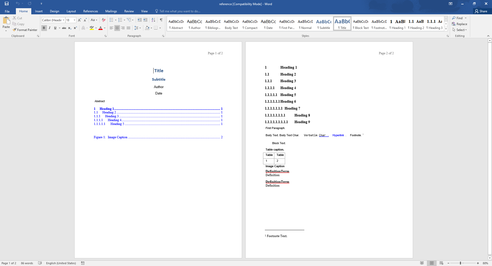
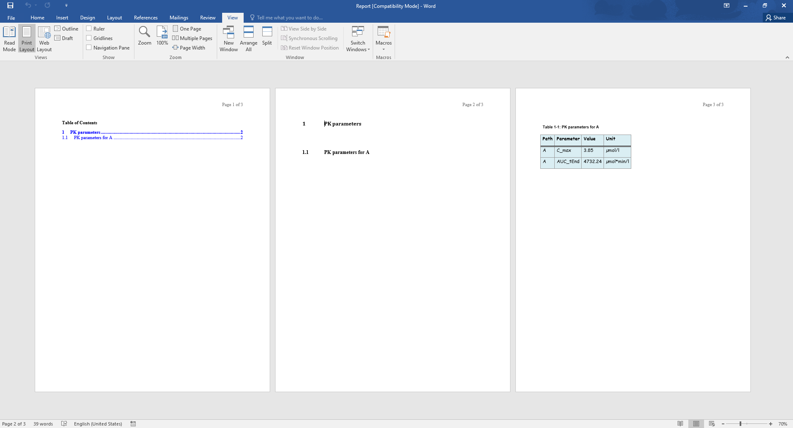

```{r vignette setup, include = FALSE}
knitr::opts_chunk$set(
  collapse = TRUE,
  comment = "#>"
)
source(system.file("extdata", "vignette-helpers.R", package = "ospsuite.reportingengine"))
```

```{r setup}
require(ospsuite.reportingengine)
```


For each workflow, the Reporting Engine exports a [markdown](https://www.markdownguide.org/) version of your report (*.md*).
A Word version (*.docx*) - converted from the markdown - is also exported by default via the logical field [`createWordReport`](../reference/Workflow.html#public-fields).

This article aims at documenting available options and settings that work with the conversion of the markdown report into its word version.

## Installing Pandoc

[**Pandoc**](https://pandoc.org/) is the software responsible for the conversion of the markdown report into its word version.
As a consequence, the installation of **pandoc** is required for this feature.
If you need to install **pandoc**, please follow the instructions provided on the [GitHub](https://github.com/Open-Systems-Pharmacology/OSPSuite.ReportingEngine/wiki/Installing-pandoc).

<!--- TODO: the wiki is currently empty and needs to have instructions for the user -->

## Word Conversion Template

The *Word Conversion Template* is a word document used by **pandoc** that provides a reference styling of your word document.
The location of the template file needs to be indicated to workflow field [`wordConversionTemplate`](../reference/Workflow.html#public-fields). 

<details><summary>MS Word view of *Word Conversion Template*</summary>

```{r, include = FALSE}
# After running each vignette, their output is cleared when using devtools::check()
# However, the content of "figures/" directory is required for docs/articles that display vignettes as a webpage
# Thus, the file is temporarily copied to "figures/"
dir.create("figures", showWarnings = FALSE)
file.copy(
  from = system.file("extdata", "reference-docx.png", package = "ospsuite.reportingengine"),
  to = "figures"
)
```

{width="90%"}

</details>


### How to get the template

Workflows use the following default template which can be downloaded via [GitHub](https://github.com/Open-Systems-Pharmacology/OSPSuite.ReportingEngine/blob/develop/inst/extdata/reference.docx)

Otherwise you can copy the file directly from its location within the package as illustrated below.

```r
wordConversionTemplate <- system.file("extdata", "reference.docx", package = "ospsuite.reportingengine")
file.copy(from = wordConversionTemplate, to = getwd())
```

### How to update the template

As indicated in [pandoc documentation](https://pandoc.org/MANUAL.html#options-affecting-specific-writers),
*Paragraph styles*, *Character styles* and *Table style* items can be modified in the *Word Conversion Template*.

In the following bullet points, tutorial videos shows how to update such style items.

<details><summary><strong>Paragraph and Character styles</strong></summary>

```{r, include = FALSE}
file.copy(
  from = system.file("extdata", "paragraph-styles-reference-doc.mp4", package = "ospsuite.reportingengine"),
  to = "figures"
)
```

{width="90%"}

</details>

<details><summary><strong>Table style</strong></summary>

Note that only one Table style named [**Table**](https://github.com/jgm/pandoc/issues/7746) is used by pandoc for styling the converted tables.

Note that the font in the table needs to be defined by updating the character style named [*Compact*](https://github.com/Open-Systems-Pharmacology/OSPSuite.ReportingEngine/issues/857).

**Limitations**: As indicated in issue [#857](https://github.com/Open-Systems-Pharmacology/OSPSuite.ReportingEngine/issues/857),
styling does not account for text alignment/justification within the table.

```{r, include = FALSE}
file.copy(
  from = system.file("extdata", "table-style-reference-doc.mp4", package = "ospsuite.reportingengine"),
  to = "figures"
)
```

{width="90%"}

</details>


## An Example

Using Example 1 from the article [**PK Parameters**](pk-parameters.html#example-1) and the word conversion template defined in the tutorials above.
The following word document is generated by indicating the template as done below

<details><summary>Word Version of Report of Example 1</summary>

```r
myExampleWorkflow <- MeanModelWorkflow$new(
    simulationSets = myExampleSet,
    workflowFolder = "myExample-Results",
    wordConversionTemplate = "reference.docx"
  )
```

```{r, include = FALSE}
file.copy(
  from = system.file("extdata", "report-reference-docx.png", package = "ospsuite.reportingengine"),
  to = "figures"
)
```

{width="100%"}

</details>

## Tips for Report Conversion

Before rendering the word report, the Reporting Engine creates an intermediate markdown report dedicated to the conversion (`"report-word.md"`).
Then, the intermediate report and the configuration options (`"report-configuration.txt"`) are provided to **pandoc** using the `{knitr}` package as illustrated below.

**Users can leverage the features from the Reporting Engine processing of the markdown**.

```r
knitr::pandoc(input = "report-word.md", format = "docx", config = "report-configuration.txt")
```

The content of the configuration options (`"report-configuration.txt"`) is described below:

```yaml
embed-resources:
standalone:
wrap: none
toc:
from: markdown+tex_math_dollars+superscript+subscript+raw_attribute
reference-doc: <wordConversionTemplate>
resource-path: <workflowFolder>
```

The option `+raw_attribute` allows [pandoc](https://pandoc.org/MANUAL.html#extension-raw_attribute) to leave raw code block as is.
This option is convenient when including page breaks and bookmarks in your word reports as described below.

### Include LaTeX equations

The option `+tex_math_dollars` allows [pandoc](https://pandoc.org/MANUAL.html#extension-tex_math_dollars) 
to translate mathematical equations defined in [*LaTeX*](https://en.wikibooks.org/wiki/LaTeX/Mathematics).

<!--- Link to LateX wikibook that provides lists of symbols, letters and operators -->

Unfortunately, the translation works only to some extent as some formatting options cannot be translated (e.g. `\Huge` - [#1029](https://github.com/Open-Systems-Pharmacology/OSPSuite.ReportingEngine/issues/1029)).

Inline equations can be defined using within `$..$` while equation block within `$$...$$` as illustrated below.

```latex
$$
A \rightarrow B \rightarrow C \\
\frac{dA}{dt} = -k_aA  \\
\frac{dB}{dt} = k_aA - k_bB  \\
\frac{dC}{dt} = k_bB - k_cC  \\
$$
```

would render

$$
A \rightarrow B \rightarrow C \\
\frac{dA}{dt} = -k_aA  \\
\frac{dB}{dt} = k_aA - k_bB  \\
\frac{dC}{dt} = k_bB - k_cC
$$

### Superscript and subscript can be indicated through *html* tags

The options `+superscript` and `+subscript` allows [pandoc](https://pandoc.org/MANUAL.html#superscripts-and-subscripts) 
to translate `^...^` and `~...~` into superscript and subscript within the word document.

The Reporting Engine internally translates all the *html* tags **`<sup>...</sup>`** and **`<sub>...</sub>`** of the markdown report into `^...^` and `~...~`.

Thus, **you can directly include superscript and subscript *html* tags into sub parts of their markdown reports**.

### Bookmark and Referencing 

The Reporting Engine also converts anchor *html* tag **`<a id="..."</a>`** into bookmarks.

The function [`anchor()`](../reference/anchor) can be used to generate the tag using R or you can also copy and tune the *html* below.

```html
<a id="my-bookmark"></a>
```

Then, the following [raw *openxml*](https://learn.microsoft.com/en-us/dotnet/api/documentformat.openxml.wordprocessing.bookmarkstart?view=openxml-2.8.1#remarks) code block will be added to your intermediate markdown document before conversion into word.

```xml
`<w:p><w:r><w:bookmarkStart w:id="my-bookmark" w:name="my-bookmark"/><w:bookmarkEnd w:id="my-bookmark"/></w:r></w:p>`{=openxml}
```

### Page Break 

Users can implement page breaks in their word document by including the tag **`<pagebreak>`** in their markdown document.
The tag will be converted by the Reporting Engine into the following [raw *openxml*](https://pandoc.org/MANUAL.html#extension-raw_attribute) code.

```xml
`<w:p><w:r><w:br w:type="page"/></w:r></w:p>`{=openxml}
```

__Note that `<pagebreak>` is not an actual *html* tag but a key tag exposed by the Reporting Engine for the purpose of the conversion into word document__

### Paragraph alignment/justification

Users can include *html* div tag to indicate alignment in their markdown document.
Alignment will be rendered both in previewing the markdown document and the word document.

The examples below show how to implement all available alignments

<details><summary><strong>Left aligned</strong></summary>

```html
<div align="left">Some left aligned text</div>
```

- Translated as 

```xml
`<w:pPr><w:jc w:val="left"/></w:pPr>`{=openxml}Some left aligned text
```

- Rendered as

<div align="left">Some left aligned text</div>


</details>

<details><summary><strong>Centered</strong></summary>

```html
<div align="center">Some centered text</div>
```

- Translated as 

```xml
`<w:pPr><w:jc w:val="center"/></w:pPr>`{=openxml}Some centered text
```

- Rendered as

<div align="center">Some centered text</div>

</details>

<details><summary><strong>Right aligned</strong></summary>

```html
<div align="right">Some right aligned text</div>
```

- Translated as 

```xml
`<w:pPr><w:jc w:val="right"/></w:pPr>`{=openxml}Some right aligned text
```

- Rendered as

<div align="right">Some right aligned text</div>


</details>

<details><summary><strong>Justified</strong></summary>


```html
<div align="justify">Some justified text</div>
```

- Translated as 

```xml
`<w:pPr><w:jc w:val="both"/></w:pPr>`{=openxml}Some justified text
```

- Rendered as

<div align="justify">Some justified text</div>

</details>

